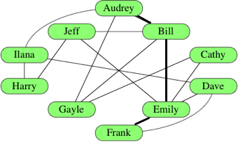
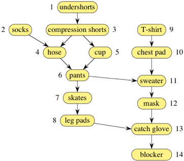

# 그래프 설명하기

## 그래프(graph) 란?

* **정점(vertex)** 과 정점들을 연결하는 **변(edge)** 으로 구성
* 정점은 원으로 표현하고 변은 화살표나 직선으로 표현
* **유향 그래프(directed graph)** 는 변을 화살표로 나타내 해당 방향으로만 이동할 수 있음
* **무향 그래프(undirected graph)** 는 직선으로 표현되어 양방향 모두 이동이 가능
* 변의 경우에는 특정한 수치를 가질 수 있는데 이를 **가중치(weight)** 라 표현함

### 경로와 최단경로

이것은 소셜 네트워크를 표현한 그래프의 예시 중 하나이다.

여기서 Audrey와 Frank가 서로 소개받고 싶어한다고 했을 때 소개받을 수 있는 경우의 수를 생각해볼 수 있다.

Frank는 Emily를 알고 Emily는 Bill을 아는데 Bill은 Audrey를 알고 있다.
이와 같은 경우, Frank와 Audrey 사이에 세 개의 변으로 이루어진 **경로(path)** 가 있다고 표현한다.

또한 Frank와 Emily 사이를 이어주는 여러 경로들 중 위의 경로가 가장 적은 변으로 이루어져 있기 때문에 이는 **최단 경로(shortest path)** 가 된다.

### 사이클

어떤 정점에서 시작하여 다시 자신에게 돌아오는 경로가 있다면 이를 **사이클(cycle)** 이라고 한다.

위 그래프에는 여러 사이클이 존재한다. Audrey부터 Bill-Emily-Jeff-Harry-Ilana를 거쳐 다시 Audrey로 오는 사이클도 그 중 하나이다. 위 그래프에서 Audrey를 포함한 가장 짧은 사이클은 Audrey-Bill-Gayle을 거쳐 Audrey로 오는 사이클이다.

### 가중치

변 위에 적은 숫자를 일반적으로 일컫는 용어는 **가중치(weight)** 이며 가중치가 있는 변이 있는 그래프를 가중 **그래프(weighted graph)** 라고 한다.

도로 지도의 경우 두 곳 간의 최단 경로를 알고 싶으면 두 정점 간의 모든 경로에서 변의 가중치 합이 최소가 되는 경로를 찾는다. 비가중 그래프에서와 같이 이런 경로를 **최단 경로(shortest path)** 라고 표현한다

예를 들면, 위의 그래프에서 뉴욕에서 콩코드로 가는 최단 경로는 뉴욕-뉴헤븐-하트퍼드-스터브릿지-웨스턴-리딩을 거쳐 콩코드로 가는 총 289의 경로이다.

### 방향

여기서 화살표로 나타난 변은 **방향성이 있으므로(directed)** 이 그래프는 **방향 그래프(directed graph)** 이다.

여기서 방향은 어떤 장비를 다른 장비보다 먼저 입어야 하는지를 나타낸다. 예를 들어 가슴 패드에서 스웨터로 가는 변은 스웨터를 입기 전에 가슴 패드를 착용해야 한다는 것을 가리킨다.

정점 옆에 쓰인 숫자는 그 장비를 착용하는 수많은 경우의 순서 중 하나를 의미한다. 따라서 팬티를 맨 처음에 입고, 양말, 쫄쫄이 반바지...마지막으로 장갑을 끼게 된다.

이 특정 방향 그래프에는 **사이클이 없다.** 이런 그래프를 **방향성 비순환 그래프(directed acyclic graph)** 또는 dag라고 한다.

방향이 있는 변에 대해서는 다른 용어를 사용한다. 방향성이 있는 변은 한 정점을 **떠나(leave)** 다른 정점으로 **들어간다(enter)** 라고 표현한다.

## 그래프의 크기

그래프를 볼 때는 정점과 변 각각을 묶어서 집합으로 생각하는 것이 좋다.

일반적으로 정점 집합을 `V`로, 변 집합을 `E`로 나타낸다.
그래프를 나타내거나 알고리즘 실행 결과를 그래프에 나타낼 경우 종종 정점과 변의 집합 크기에 대해 점근적 표기법을 사용하는데,
예를 들어 어떤 여러 변에 대한 실행 시간이 선형함수로 정의된다고 한다면 점근적 표기법으로 `Θ(|V|)`로 표기하는 것 대신 관습적으로 `|.|` 표기를 생략해 `Θ(V)`라고 쓴다. 마찬가지로 `Θ(lg|E|)`대신 `Θ(lgE)`라고 표현한다.
