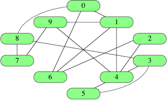

# 그래프 표현하기

그래프는 여러가지 방법으로 표현할 수 있는데, 각기 다른 장단점을 가지고 있다.

그래프를 입력값으로 어떤 상황이나 알고리즘을 실행하고자 할 때는 상황에 따라 그래프를 크게 3가지 기준으로 판단한다.

* 그래프를 나타낼 때 차지하는 메모리나 공간
    * 점근적 표기법을 사용하여 나타낸다.   
      (실행시간이 아니여도 점근적 표기법을 사용할 수 있음 (함수의 특성 묘사))
* 주어진 변이 그래프 안에 있는지 결정하는데 걸리는 시간
* 주어진 정점의 이웃을 알아내는데 걸리는 시간

정점은 "오드리" "보스톤" 또는 "스웨터" 처럼 이름으로 나타내지 않고 **숫자로 표시하는 것이 일반적**이다. 즉 `|V|`정점에 0부터 `|V|-1`까지 숫자를 붙이는 것이다. 아래는 이름이 아닌 숫자로 나타낸 10개의 정점이 있는 소셜 네트워크이다.



## 연결선 리스트(Edge lists)

* 변 `|E|`개로 이루어진 리스트나 배열로 나타내는 것
* 변: 두 정점 번호의 배열이나 변으로 연결된 정점의 숫자가 포함된 객체의 배열
* 변에 가중치가 있다면 3번째 요소를 배열에 추가하거나 더 많은 정보를 객체에 추가하여 변에 가중치를 더함
* 연결선 리스트에 필요한 총 공간은 `Θ(E)`이다.

다음은 위 소셜 네트워크 그래프를 나타내기 위해 JavaScript로 연결선 리스트를 나타낸 것이다.

```js
[
    [0,1], [0,6], [0,8], [1,4], [1,6],
    [1,9], [2,4], [2,6], [3,4], [3,5],  
    [3,8], [4,5], [4,9], [7,8], [7,9]
]
```

연결선 리스트는 간단하지만, 그래프에 특정 변이 있는지 알고 싶으면 연결선 리스트를 모두 검색해야한다. 만약 아무런 정렬 없이 무작위로 들어가 있다면 `|E|`개 중 특정 변을 선형검색 해야한다.

## 인접 행렬

`|V|` 정점이 있는 그래프에서 인접 행렬은 0과 1로 이루어진 `|V| * |V|` 행렬이다. 여기서 변 `(i,j)`가 그래프에 있을 경우에만 `i`행과 `j`열의 값이 1이 된다.

변 가중치를 지정하고자 한다면 `i`행, `j`열 항목에 가중치를 주고 변이 없을 경우를 나타내기 위한 특수값(보통 null값) 을 지정해 놓는다.

다음은 소셜 네트워크 그래프의 인접 행렬이다.

```js
[
    [0, 1, 0, 0, 0, 0, 1, 0, 1, 0],
    [1, 0, 0, 0, 1, 0, 1, 0, 0, 1],
    [0, 0, 0, 0, 1, 0, 1, 0, 0, 0],
    [0, 0, 0, 0, 1, 1, 0, 0, 1, 0],
    [0, 1, 1, 1, 0, 1, 0, 0, 0, 1],
    [0, 0, 0, 1, 1, 0, 0, 0, 0, 0],
    [1, 1, 1, 0, 0, 0, 0, 0, 0, 0],
    [0, 0, 0, 0, 0, 0, 0, 0, 1, 1],
    [1, 0, 0, 1, 0, 0, 0, 1, 0, 0],
    [0, 1, 0, 0, 1, 0, 0, 1, 0, 0]
]
```

* 인접 행렬 이름이 `graph`이고 변 `(i,j)`가 그래프에 있는지 알아보려면 `graph[i][j]`를 탐색
* 그래프가 변이 몇 개 없는 희소 그래프일 경우라도 공간을 `Θ(V^2)` 만큼 차지
* 비방향 그래프에서 인접 행렬은 대칭이다. `i`행, `j`열의 항목은 `j`행, `i`열이 1일 경우에만 1이다.

## 인접리스트

* 인접 행렬과 연결선 리스트를 결합한 형태
* 각 정점 `i`에 대해 그 정점과 인접한 정점의 배열을 저장
* 일반적으로 한 정점 당 하나의 인접 리스트가 존재하여 총 `|V|`개의 배열을 가짐


이를 JavaScript로 표현하면 다음과 같다.

```js
[
    [1, 6, 8],
    [0, 4, 6, 9],
    [4, 6],
    [4, 5, 8],
    [1, 2, 3, 5, 9],
    [3, 4],
    [0, 1, 2],
    [8, 9],
    [0, 3, 7],
    [1, 4, 7]
]
```

각 정점의 인접 리스트는 배열을 찾아보기만 하면 되기 때문에 일정 시간 내에 얻을 수 있다.

변 `(i,j)`가 그래프에 있는지 알아보려면 일정 시간 내에 `i`의 인접 리스트로 가서 `j`를 찾아보면 된다.

비방향 그래프에서 정점 `j`는 `i`가 `j`의 인접 리스트에 있을 경우에만 정점 `i`의 인접 리스트에 있다. 그래프에 가중치가 있다면 각 인접 리스트 내 각 항목은 정점 번호와 변 가중치의 두 항목으로 이루어진 배열이나 객체이어야 한다.

리스트가 `|V|`개만큼 있고 각 리스트는 `|V|-1`개만큼 정점을 가질 수 있지만 비방향 그래프의 인접 리스트에는 `2|E|`개의 항목이 있다. 각 변 `(i,j)`는 `i`의 리스트에서 한 번, 그리고 `j`의 리스트에서 한 번, 모두 합쳐서 두 번 나타나며 리스트에는 `|E|`개의 변이 있기 때문이다.

방향 그래프에서 인접 리스트는 방향성 있는 변 하나 당 한 요소씩 총 `|E|`개의 요소를 가지고 있다.
