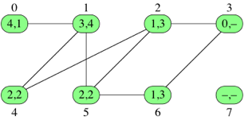

# 너비우선탐색

## 너비우선탐색(Breadth first search)이란?

BFS라고도 쓰며, 주어진 소스 정점에서 다른 모든 정점에 이르기까지 거치는 변의 수를 계산해 가장 짧은 경로를 찾는 알고리즘이다.

너비 우선 탐색은 각 정점 `v`에 다음과 같은 두 개의 값을 할당한다.

* **거리**: 소스 정점에서 정점 `v`에 이르는 아무 경로에 있는 변의 최소 수를 나타냄
* **선행 정점**: 소스 정점에서 가장 짧은 경로 내 `v`의 선행자 정점. 소스 정점의 선행자는 `null`과 같은 특수 값을 가지는데 이는 선행 정점이 없음을 의미함

소스 정점에서 정점 `v`에 이르는 경로가 없다면 `v`의 거리는 무한하며 그 선행 정점은 소스의 선행 정점과 같이 특별한 값을 갖게 된다.

## 너비우선탐색 설명하기



* 시작할 때 각 정점의 거리와 선행 정점을 `null`로 초기화

* 소스 정점에서 시작해 이 정점의 거리에 0을 할당

* 소스 정점의 이웃을 모두 방문, 각 이웃의 거리를 1로 설정하고 선행 정점에 소스 정점의 값을 대입

* 소스 정점과의 거리가 1인 정점의 이전에 방문된 적이 없는 모든 이웃을 방문

* 방문된 모든 정점의 거리를 2로 설정하고 선행 정점에는 방문한 정점의 숫자를 설정

* 계속해서 소스 정점에서 다다를 수 있는 모든 정점을 방문할 때까지 이 과정을 계속함  
(이 때 거리가 `k+1`인 정점을 방문하기 전에 소스에서 거리가 `k`인 모든 정점을 항상 방문해야 한다)

이 과정에서 두가지 문제가 생기는데 다음과 같이 해결할 수 있다.

* 어떤 정점에 이미 가봤는지 여부를 어떻게 결정하는가?
    * 가보기 전의 정점의 거리는 `null`일 것이고 이미 접근한 정점의 값은 채워져 있기 때문에 정점의 거리가 `null`로 되어 있는 정점만 방문하면 됨

* 어떤 정점을 이미 가봤지만 그 곳에서 출발한 적은 없는지 어떻게 확인하는가?
    * `Queue`를 이용해 해결한다
        * 어떤 정점을 처음 가게 되면 그 정점을 enqueue
        * 어느 정점을 다음으로 가야 할지 결정하기 위해 dequeue

## 너비우선탐색 구현하기

```py
import queue


def do_bfs(graph, source):
    
    results = {}
    q = queue.Queue()

    # 결과 객체를 graph 정점 갯수만큼 초기화
    for v in graph:
        results[v] = {'distance': None, 'predecessor': None}

    # 소스 정점 거리를 0으로 초기화
    results[source]['distance'] = 0
    # 큐에 enqueue
    q.put(source)

    # 탐색이 필요한 정점이 없을때까지
    while q.qsize() > 0:
        # 큐에서 dequeue
        vertex = q.get()

        # dequeue해서 얻은 정점의 인접한 정점 순환
        for neighbor in graph[vertex]:
            
            # 방문하지 않은 이웃 정점이면
            if results[neighbor]['distance'] == None:
                # 이웃 정점의 거리는 현재 dequeue된 정점 + 1
                results[neighbor]['distance'] = results[vertex]['distance'] + 1
                # 이웃 정점의 선행 정점은 현재 dequeue된 정점
                results[neighbor]['predecessor'] = vertex
                # queue에 enqueue
                q.put(neighbor)
    
    # 결과 객체 반환
    return results
```

### 실행

```py
# 그래프 예시
graph = {
    0: [1,],
    1: [0, 4, 5,],
    2: [3, 4, 5,],
    3: [2, 6,],
    4: [1, 2,],
    5: [1, 2, 6,],
    6: [3, 5,],
    7: [],
}

# 탐색 결과 저장
results = do_bfs(graph, 3)

for vertex in results:
    print('vertex: {}'.format(vertex), end=', ')
    print('distance: {}'.format(results[vertex]['distance']), end=', ')
    print('predecessor: {}'.format(results[vertex]['predecessor']))
```

### 결과

```
vertex: 0, distance: 4, predecessor: 1
vertex: 1, distance: 3, predecessor: 4
vertex: 2, distance: 1, predecessor: 3
vertex: 3, distance: 0, predecessor: None
vertex: 4, distance: 2, predecessor: 2
vertex: 5, distance: 2, predecessor: 2
vertex: 6, distance: 1, predecessor: 3
vertex: 7, distance: None, predecessor: None
```

## 너비우선탐색 분석하기

### 실행시간

정점이 `V`개이고 변이 `E`개인 그래프를 너비 우선 탐색하는데 걸리는 시간은 `O(V + E)`이다.

너비우선탐색을 하는 그래프에서 그렇듯이 `|E| >= |V|`라고 가정해 보면

이 때 `|V| + |E| <= |E| + |E| = 2 * |E|`이다.

점근적 표기법에서는 상수로 된 요소를 무시하기 때문에 `|E| >= |V|`일 때에는 `O(V + E)`가 곧 `O(E)`가 되는 것을 알 수 있다.

하지만 만약 `|E| < |V|`라서 `|V| + |E| <= |V| + |V| = 2 * |V|`이면 `O(V + E)`가 곧 `O(V)`로 되는 것을 알 수 있다.

결국 `O(max(E,V))`인데, `O(V + E)`와 같은 시간을 의미한다.
