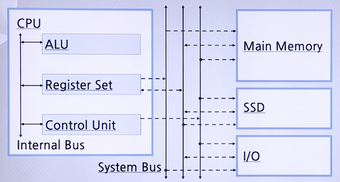

# 컴퓨터 구조 개요

## 컴퓨터 시스템의 구조

컴퓨터 시스템은 아주 복잡한 머신이지만 다음과 같이 크게 5가지 구성으로 나타낼 수 있다.

* CPU
    * Central Processing Unit의 약자
    * 산술 논리연산, 제어를 수행
* Main Memory
    * RAM(Random Access Memory)의 약자
* SSD
    * Secondary Storage Devices의 약자
    * 데이터를 저장하는 용도이지만 메인 메모리와 쓰임새는 완전히 다름
* I/O
    * Input/Output Devices의 약자
    * 키보드, 마우스는 인풋, 모니터, 프린터 등의 기기는 아웃풋
* System Bus
    * 각 구성들을 서로 연결해주는 역할

SSD의 경우 I/O의 일부로 분리하기도 함

### CPU 내부

* ALU
    * Arithmetic and Logic Unit의 약자
    * CPU 내에서 산술 논리 연산을 담당함
* Register set
    * CPU 내에 임시로 데이터를 저장하는 공간인 Register의 집합
    * ALU가 Register set에서 데이터를 사용해 연산을 수행한 뒤 결과를 저장하는데 사용함
* Control Unit
    * CPU와 다른 구성의 데이터 R/W 신호를 제어함
* Internal Bus
    * System Bus와 다른 개념
    * CPU 내부에서 각각의 서브 블락들을 연결해주는 역할

#### ALU 개요

* AU: Arithmetic Unit
    * `+`, `-`, `*`, `%` 등 산술 연산 담당
* LU: Logic Unit
    * `OR`, `AND`, `NOT`, `EX-OR` 등 논리 연산 담당
    
#### Register set 개요

* Register간 여러 Path 존재
* 일반 목적 Register: Shift Register, Status Register
* 특수목적 Register
    * ACC: Accumlator
        * 지금 현재 처리되어야 할 데이터들을 저장해 놓는 Register
        * 누적 연산의 저장에 사용됨
    * SP: Stack Pointer
    * PC: Program Counter
        * 지금 수행되어야 할 프로그램이 저장되어 있는 메모리 주소를 저장
    * MAR: Memory Address Register
        * 메모리에 접근하려는 주소를 저장
    * MBR: Memory Buffer Register
        * MAR에 저장된 주소로 메모리에 접근해 데이터를 불러 저장
    * IR: Instruction Register
        * Instruction(명령어)을 저장
        * 저장된 명령어는 Control Unit의 Instruction Decoder로 이동

#### Control Unit 개요

* ID: Instruction Decoder
    * 명령어를 컴퓨터가 실행할 수 있는 형태로 변환
    * 결과로 Control Memory의 주소를 지정
* CAR: Control Address Register
    * ID의 결과값이 저장된 Address를 지정
* CM: Control Memory
    * Machine Instruction을 Micro Instruction으로 변환
    * 제어 신호를 Control Buffer Memory에 저장
* CBR: Control Buffer Memory
    * 제어 신호를 저장
    * System Bus의 Control Bus에 제어 신호를 전송

### System Bus 개요

1. Address Bus
    * CPU에서 메모리에 있는 데이터를 가지고 오기 위해 주소를 전송
    * CPU에서 메모리로 주소를 건네주기 떄문에 단방향
2. Data Bus
    * 메모리에 있는 데이터를 CPU로 전송
    * CPU에서 메모리로 데이터가 이동하는 경우도 있기 때문에 양방향
2. Control Bus
    * CPU에서 제어 신호를 메모리로 보낼 때 사용
    * Interrupt 상황때문에 양방향

### Main Memory 내부

* Cache
    * Main Memory의 데이터들 중에서 빠른 시일 내에 CPU가 읽어갈 것 같은 데이터를 저장
    * RAM이나 ROM과는 달리 반도체를 이용해서 만들어 매우 빠른 속도
    * CPU가 Main Memory에 접근할 때 먼저 접근해서 데이터를 색인

* Addressing Mode
    * 주소지정방식을 상황에 따라 다르게 지정

### Main Memory와 SSD의 특징 및 차이점

 구분 | Main Memory | SSD
 -----|-------------|-----
 Access 방식 | CPU가 Register를 통해 Access하는 Memory | CPU가 별도의 Controller을 통해 Access하는 Memory
 Device 종류 | RAM, ROM, Cache | Magnetic Disk, Optical Disk, RAID
 특징 | Speed`^`, Cost`^`, Area/Capacity`^`, Volatile | Speed`_`, Cost`_`, Area/Capacity`_`, Nonvolatile

### I/O와 SSD의 특징 및 차이점

* CPU 입장에서 SSD와 I/O는 동일하게 취급
* Status Register와 Data Register는 별도의 Address 할당
* Device Controller에서 System Bus와의 연결 관할 (CPU에서 직접 접근 못함)
* Keyboard, Printer: Bytes(8 Bit) 단위로 전송
* Secondary Storage Device: Block(512/1024/4096 Bytes) 단위로 전송
* SSD: Controller내의 한 Block 이상을 임시 저장할 수 있는 Data Buffer 필요