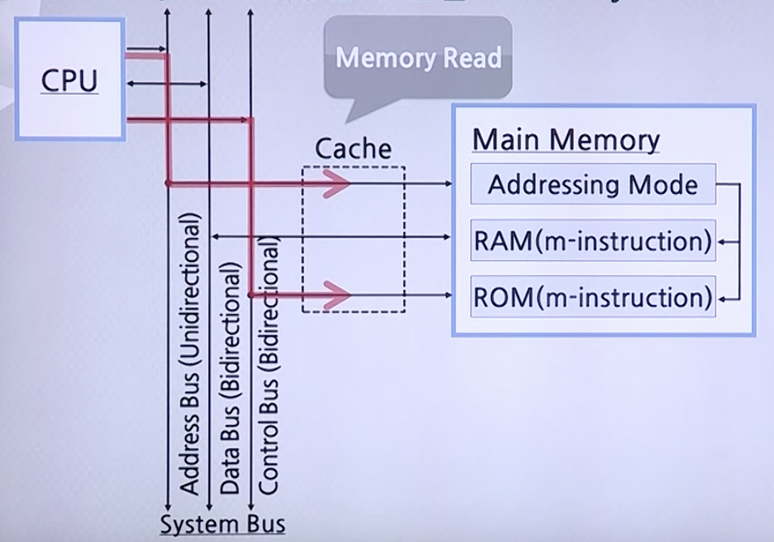
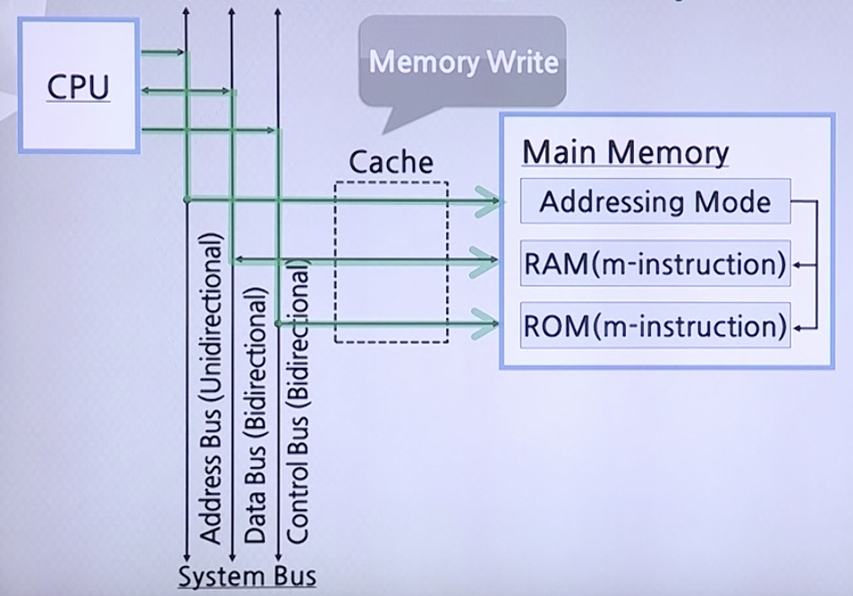

# 컴퓨터 구조 개요

## 컴퓨터 구성품의 연결

### 데이터 입출력의 종류

* Memory Read: Main Memory에서 데이터를 읽음
* Memory Write: Main Memory에서 데이터를 씀
* I/O Read: SSD에서 데이터를 읽음
* I/O Write: SSD에서 데이터를 씀

### Main Memory

#### CPU에서 Main Memory의 데이터를 읽어오는 순서

1. Address Bus를 통해 접근하려는 주소를 전송시킴
2. Control Bus를 통해 `Read Enable` 신호를 전송시킴
3. Cache 안에 데이터가 있다면 Data Bus로 CPU에게 전송
4. Cache에 데이터가 없다면 Main Memory에서 데이터를 찾아 CPU에게 전송

#### CPU에서 Main Memory에 데이터를 쓰는 순서

1. Address Bus를 통해 쓰려고 하는 메모리의 주소를 전송
2. Control Bus를 통해 `Write Enable` 신호를 전송
3. Data Bus를 통해 데이터를 전송

### I/O Device

#### I/O Device Controller

* CPU로부터 I/O 명령을 받아, 해당 I/O 장치를 제어, Data를 이동함으로써 명령을 수행
* 상태 Register: I/O 장치의 현재 상태를 나타내는 Bit들을 저장한 Register, 준비상태(RDY) Bits, Data 전송확인 (ACK) Bits 등
* Data Register: CPU와 I/O 장치 간에 이동되는 Data를 일시적으로 저장하는 Register

CPU는 현재 Device Controller 내에 데이터의 상태를 알 수 없기 때문에 Status Register에서 현재 데이터의 상태를 표시하고 CPU에서 이를 확인함

### System Bus의 공유

#### Bus Arbitration

버스 중재 방식

* Parallel Arbitration
    * **Bus Priority를 병렬로 부여**
    * Centralized PA, Decentralized PA
* Serial Arbitration
    * **Bus Priority를 직렬로 부여**
    * Centralized SA, Decentralized SA
* Polling
    * **요구한 디바이스에게 우선 부여**
    * H/W Polling, S/W Polling

### I/O Device 접속 방식의 종류

#### I/O Device Access

* Programmed I/O
    * **CPU가 외부 Data 입력상태를 주기적으로 검사**
        * Status Register을 통해 CPU가 입력상태를 판단
    * Memory-Mapped I/O, Isolated I/O
* Interrupt Driven I/O
    * **I/O가 CPU에게 Data가 입력되었음을 알림**
        * Control Bus를 통해 CPU에게 전달
    * Multiple Interrupt, Daisy Chain, S/W Polling
* I/O with DMA(Direct Memory Access)
    * **Data 입출력을 별도의 Processor가 관리**
        * CPU가 입력상태에 대해 전혀 관여하지 않음
    * DMA 1, DMA 2, DMA with I/O Bus, DMA with I/O Processor
