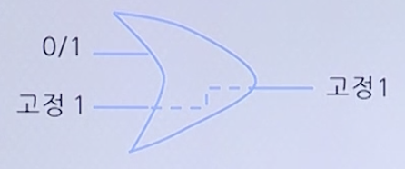
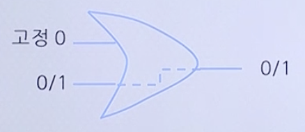
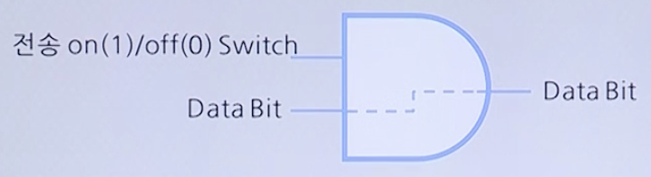
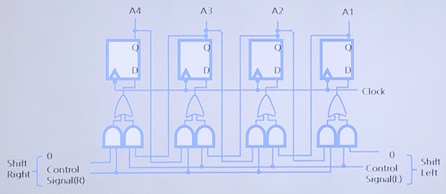
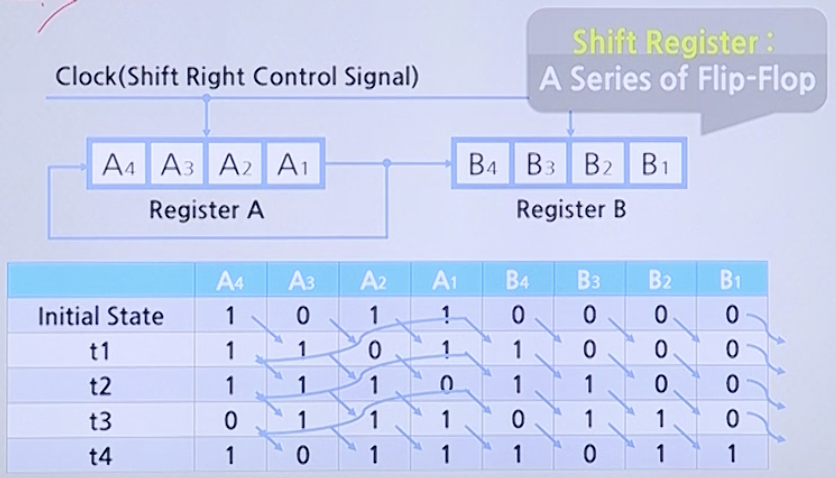

# ALU Architecture와 Integer Representation

## Logic Operations

A | B | NOT A | NOT B | A AND B | A OR B | A XOR B
--|---|-------|-------|---------|--------|--------
A | B | ~A    | ~B    | A ∧ B   | A ∨ B  | A ⊕ B
0 | 0 | 1     | 1     | 0       | 0      | 0
0 | 1 | 1     | 0     | 0       | 1      | 1
1 | 0 | 0     | 1     | 0       | 1      | 1
1 | 1 | 0     | 0     | 1       | 1      | 0

### 다른 관점에서 각종 Gate 이해

* OR Gate는 입력과 관계 없이 출력을 1로 생성 가능

* OR Gate는 Bit를 전송 가능

* AND Gate는 Bit의 전송을 제어 가능

* XOR Gate는 두 입력이 같은지를 평가 가능

* XOR Gate는 Complement를 취할 수 있음

### Examples

AND      | OR       | XOR      | NOT
---------|----------|----------|----------
10110101 | 10110101 | 10110101 | 10110101
00111011 | 00111011 | 00111011 | -
**00110001** | **10111111** | **10101110** | **01101010**

selective-set (OR) | selective-complement (XOR) | mask (AND) | insert (AND & OR) | compare (XOR)
-------------:|---------------------:|-----:|-------:|---------:
 10010010 | 10010010 | 11010101 | 10010101 | 11010101
∨_00001111 | ⊕_00001111 | ∧_00001111 | ∧_00001111 | ⊕_10010110
-        | -        | -        | 00000101 | -       
-        | -        | -        | ∨_11100000 | -       
**10011111** | **10011101** | **00000101** | **11100101** | **01000011** (모두 0이면 Zero Flag Set)

## Shift Operation : Logical Shift (LSR, LSL)

### D Flip-Flop

* 1 Bit의 Information을 저장하는 Logic Element
* Clock이 입력되면 (Rising/Falling Edge) 기존 저장 값이 Q로 출력되고 D의 입력이 D Flip-Flop에 저장됨
* Rgister은 여러 개의 Flip-Flop을 연결한 형태 (8 Bit Register -> 8개의 Flip-Flop)

* Data 손실이 없다는 가정 하에
    * 0100 -> 1000 (LSL, *2의 효과)
    * 0101 -> 0010 (LSR, /2의 효과)

## Shift Operation : Arithmetic Shift (ASR, ASL)

### Arithmetic Shift

* 1001 -> 1010 (ASL, No Sign Bit Change)
* 1001 -> 1100 (ASR, Sign Bit Extension)

Data 손실이 없다는 가정하에 항상 *2, /2

* 0001 -> 0010 (ASL, No Sign Bit Change)
* 0001 -> 0000 (ASR, Sign Bit Extension)

Data 손실이 없다는 가정하에 항상 *2, /2

### Circular Shift

* 1001 -> 1100 (CSR)
* 1001 -> 0011 (CSL)

* 4번 반복하게 되면 Register A (A1 ~ A4)의 값은 Register B (B1 ~ B4)로 모두 이동
* Register A의 값은 다시 원 상태로 돌아옴
