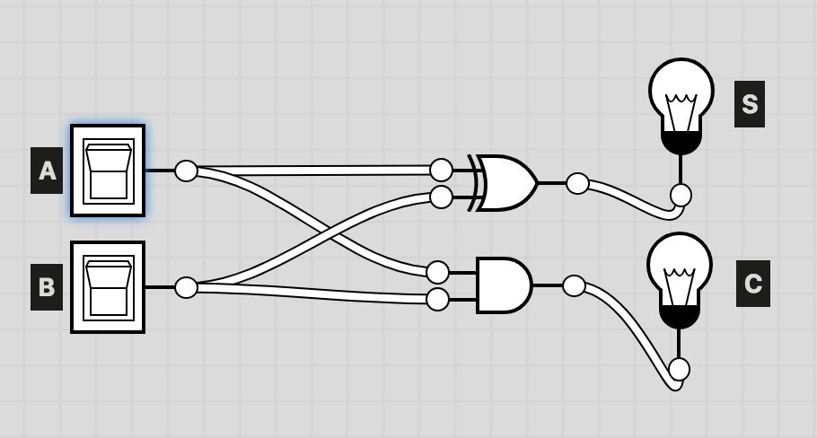
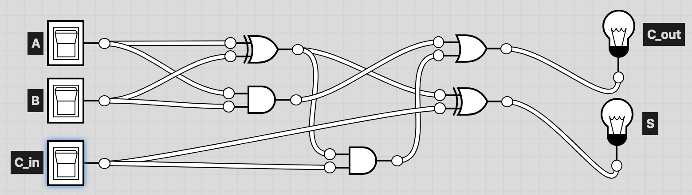
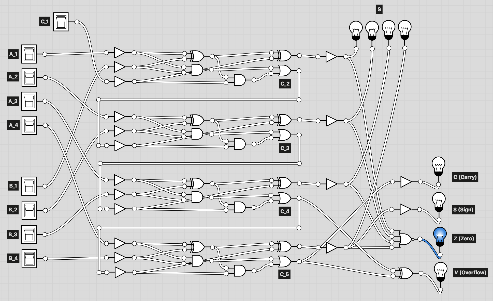

# ALU Architecture와 Integer Representation

## Integer Arithmetic (+/-)

### Addition: Half adder

A | B | Cout | S
--|---|-----------------|--
0 | 0 | 0               | 0
0 | 1 | 0               | 1
1 | 0 | 0               | 1
1 | 1 | 1               | 0

#### Boolean Expression

* **Cout** = A ∧ B
* **S** = A ⊕ B

## Addition: Full adder

A | B | Cin | S | Cout
--|---|----------------|---|----------------
0 | 0 | 0              | 0 | 0
0 | 0 | 1              | 1 | 0
0 | 1 | 0              | 1 | 0
0 | 1 | 1              | 0 | 1
1 | 0 | 0              | 1 | 0
1 | 0 | 1              | 0 | 1
1 | 1 | 0              | 0 | 1
1 | 1 | 1              | 1 | 1

#### Boolean Expression

* **Cout** = ((A ⊕ B) ∧ Cin) ∨ (A ∧ B)
* **S** = A ⊕ B ⊕ C

#### 4Bit Full adder

##### Why V = C4 ⊕ C5 ?

* 결국 부호가 바뀌는지를 판단하기만 하면 됨
    * 전 자리수 받아올림 `0 -> 1`
    * 부호 자리수 올라감 `1 -> 0`
* ex) 2Bit addition

    _      | _      | 1      | 0      | -1     | -2    
    -------|--------|--------|--------|--------|-------
    _      | _      | 01     | 00     | 11     | 10    
    1      | 01     | **10** | 01     | 00     | 11    
    0      | 00     | 01     | 00     | 11     | 10    
    -1     | 11     | 00     | 11     | 10     | **01**
    -2     | 10     | 11     | 10     | **01** | **00**