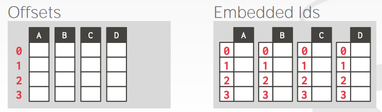

# Database Storage 2

## Data Representation

* `INTEGER`, `BIGINT`. `SMALLINT`, `TINYINT`
    * C/C++ Represention
* `FLOAT`, `REAL` vs `NUMERIC`, `DECIMAL`
    * IEEE-754 Standard / Fixed-point Decimals
* `VARCHAR`, `VARBINARY`, `TEXT`, `BLOB`
    * Header with length, followed by data bytes
* `TIME`, `DATE`, `TIMESTAMP`
    * 32/64-bit interger of (micro)seconds since Unix epoch

## Variable Precision Numbers

정확하지 않은 Native C/C++ 타입을 사용하는 실수 타입이다.

IEEE-754 에 지정된 형식 대로 저장된다.

형식적으로 arbitrary precision numbers 보다 빠르다.
* Ex) `FLOAT`, `REAL` / `DOUBLE`

## Fixed Precision Numbers

임의로 고정된 자릿수와 스케일의 숫자 데이터 타입이다. round 에러가 발생하지 말아야 할 때 사용된다.
* Ex) `NUMERIC`, `DECIMAL`

형식적으로 추가 메타데이터가 포함 된 정확한 Variable-length Binary 표현으로 저장된다.
* `VARCHAR` 와 같지만 String 으로 저장되지 않는다.

## Postgres: NUMERIC

```cpp
typedef unsigned char NumericDigit;
typedef struct {
    int ndigits;            // # of Digits
    int weight;             // Weight of first Digit
    int scale;              // Scale Factor
    int sign;               // Positive/Negative/NaN
    NumericDigit *digits;   // Digit Storage
} numeric;
```

## Large Values

대부분의 DBMS 는 튜플이 Page 크기를 넘는 것을 혀용하지 않는다.

Page 크기보다 더 큰 데이터를 저장하기 위해서 DBMS 는 분리된 `Overflow storage page` 를 사용해야 한다.
* Postgres: TOAST (> 2KB)
* MySQL: Overflow (> 1/2 size of page)


## External Value Storage

몇 시스템은 별도의 파일(External File)에 매우 큰 값을 저장 할 수 있도록 지원한다.

`BLOB` 이라는 타입으로 사용한다.
* Oracle: `BFILE` data type
* Microsoft: `FILESYSTEM` data type

DBMS 가 External File 에 있는 데이터를 컨트롤하지 못한다.
* No durability protections.
* No transaction protections.


## System Catalogs

DBMS 는 Internal Catalogs 에 Database 에 관한 Meta-data 를 저장한다.
* Tables, columns, indexes, views
* Users, permissions
* Internal statistics

대부분은 DBMS 가 스스로 Database 의 카탈로그를 항상 저장한다.
* 튜플을 객체 추상화 시킨다.
* 카탈로그 테이블의 "Bootstrapping" 을 위한 특수 코드.

Database 의 정보를 얻기 위해 `INFORMATION_SCHEMA` 를 쿼리할 수 있다.
* ANSI 에서 Database 의 tables, views, columns, procedures 를 제공하는 read-only view 를 가지는 것을 표준으로 정의했다.

DBMS 는 또한 Database Information 을 탐색하기 위한 비표준 Shortcuts 를 가질 수 있다.

## Accessing Table Schema

`student` 테이블의 테이블 정보를 보려면...

```sql
-- SQL-92
SELECT *
FROM INFORMATION_SCHEMA.TABLES
WHERE table_name = 'student';

-- Postgres
\d student;

-- MySQL
DESCRIBE student;

-- SQLite
.schema student;
```

## Observation

Relational Model 은 튜플의 모든 속성을 Page 에 저장해야 한다고 지정하지 않았다.

그러나 이것은 실제로 일부 Workload 에 적합한 레이아웃이 아닐 수도 있다...

## OLTP

On-line Transaction Processing
* 한개 정도의 엔티티와 관련이 있는 작은 양의 데이터를 읽거나 쓰는 간단한 쿼리

일반적으로 사람들이 먼저 구축하는 Applications 에서의 쿼리 구성이다.

## OLAP

On-line Analytical Processing
* 여러 엔티티에 걸쳐 있는 데이터베이스의 많은 부분을 읽어야 하는 복잡한 쿼리

OLTP applications 으로 수집해온 데이터를 기반으로 OLAP Workload 를 실행한다.

## Database Storage Models

DBMS 는 OLTP 나 OLAP 각각의 상황에 적합한 튜플의 다른 저장 방법을 제공한다.

## N-ary Storage Model (NSM)

DBMS 가 하나의 튜플에 대한 모든 속성을 Page 에 연속적으로 저장한다.
* Row storage 라고도 한다.

각각의 단독적인 엔티티에 대한 insert-heavy 한 작업이 다분한 OLTP 워크로드에게 이상적이다.

Advantages
* Insert, Update, Delete 가 빠르다.
* 전체적인 Tuple 하나를 쿼리할 때 좋다.

Disadvantages
* 테이블의 많은 부분이나 속성의 subset 을 스캔하는데 좋지 않다.

## Decomposition Storage Model (DSM)

DBMS 가 모든 튜플에 대한 단일 속성깂을 Page 에 연속적으로 저장한다.
* Column storage 라고도 한다.

Table 의 속성에 대한 subset 들을 넓게 스캔해야 하는 read-only 쿼리로 이루어진 OLAP 워크로드에게 이상적이다.

## DSM: Tuple Identification

Choice #1: Fixed-length Offsets
* 각각의 값들은 속성에 대해 똑같은 길이를 가진다.

Choice #2: Embedded Tuble Ids
* 각각의 값들은 컬럼마다 튜플 ID를 같이 저장한다.



Advantages
* DBMS 는 오직 필요한 Data 만 읽기 때문에 대부분의 불필요한 I/O 를 줄일 수 있다.
* 데이터 압축에 대해 더 나은 Query Processing 을 제공한다.

Disadvantages
* 튜플의 분리/결합 때문에 Insert, Update, Delete 가 느리다.