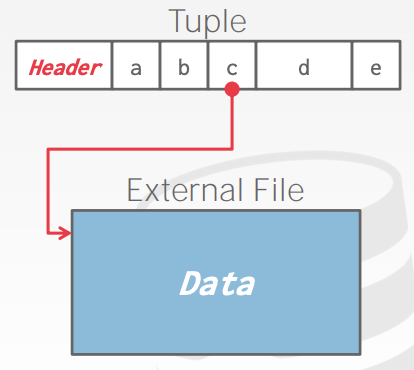

# Database Storage 2

## Data Representation

* `INTEGER`, `BIGINT`. `SMALLINT`, `TINYINT`
    * C/C++ Represention
* `FLOAT`, `REAL` vs `NUMERIC`, `DECIMAL`
    * IEEE-754 Standard / Fixed-point Decimals
* `VARCHAR`, `VARBINARY`, `TEXT`, `BLOB`
    * Header with length, followed by data bytes
* `TIME`, `DATE`, `TIMESTAMP`
    * 32/64-bit interger of (micro)seconds since Unix epoch

## Variable Precision Numbers

정확하지 않은 Native C/C++ 타입을 사용하는 실수 타입이다.

IEEE-754 에 지정된 형식 대로 저장된다.

형식적으로 arbitrary precision numbers 보다 빠르다.
* Ex) `FLOAT`, `REAL` / `DOUBLE`

## Fixed Precision Numbers

임의로 고정된 자릿수와 스케일의 숫자 데이터 타입이다. round 에러가 발생하지 말아야 할 때 사용된다.
* Ex) `NUMERIC`, `DECIMAL`

형식적으로 추가 메타데이터가 포함 된 정확한 Variable-length Binary 표현으로 저장된다.
* `VARCHAR` 와 같지만 String 으로 저장되지 않는다.

## Postgres: NUMERIC

```cpp
typedef unsigned char NumericDigit;
typedef struct {
    int ndigits;            // # of Digits
    int weight;             // Weight of first Digit
    int scale;              // Scale Factor
    int sign;               // Positive/Negative/NaN
    NumericDigit *digits;   // Digit Storage
} numeric;
```

## Large Values

대부분의 DBMS 는 튜플이 Page 크기를 넘는 것을 혀용하지 않는다.

Page 크기보다 더 큰 데이터를 저장하기 위해서 DBMS 는 분리된 `Overflow storage page` 를 사용해야 한다.
* Postgres: TOAST (> 2KB)
* MySQL: Overflow (> 1/2 size of page)


## External Value Storage

몇 시스템은 별도의 파일(External File)에 매우 큰 값을 저장 할 수 있도록 지원한다.

`BLOB` 이라는 타입으로 사용한다.
* Oracle: `BFILE` data type
* Microsoft: `FILESYSTEM` data type

DBMS 가 External File 에 있는 데이터를 컨트롤하지 못한다.
* No durability protections.
* No transaction protections.



