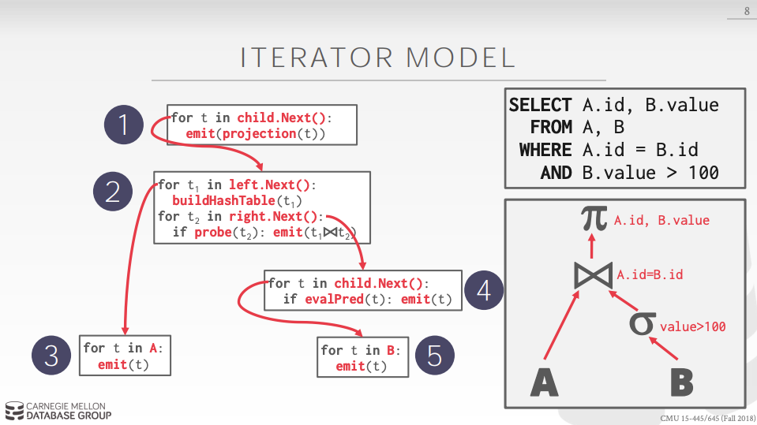
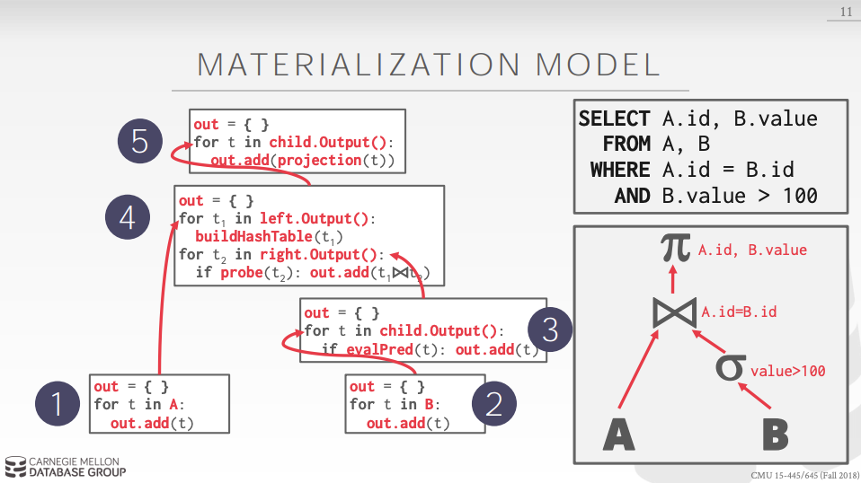
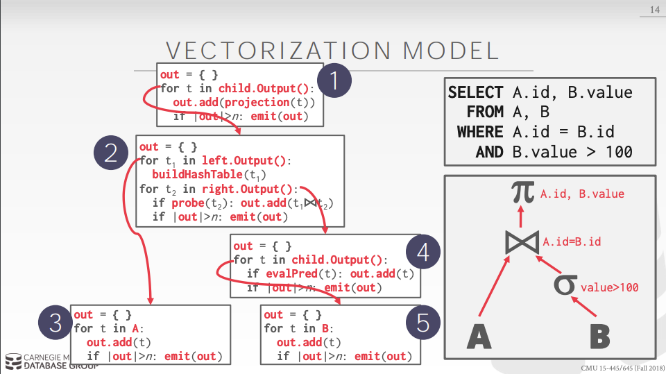

# Query Processing

## Query plan

연산자는 트리로 배열된다.

데이터는 리프에서 루트로 흐르게 된다.

루트 노드로부터의 아웃풋은 쿼리의 결과이다.

## Processing Model

DBMS 의 프로세싱 모델은 시스템이 어떻게 쿼리 플랜을 실행시키는지에 대한 정의이다.
* 각각의 워크로드마다 서로 다른 장단점을 가진다.

세 개의 접근법이 있다.
* Iterator Model
* Materialization Model
* Vectorized / Batch Model

## Iterator Model

각각의 쿼리 플랜의 연산자가 다음 함수를 표현한다.
* 각 호출에서 연산자는 더이상 튜플이 없으면 단일 튜플 또는 null 마커를 반환한다.
* 연산자는 자식에 대한 next 를 호출하여 튜플을 검색한 다음 처리하도록 루프를 구현한다.

Top-down plan processing.

Volcano or Pipeline Model 이라고도 불린다.

대부분의 DBMS 가 튜플 파이프라이닝을 지원하기 위해 사용한다.

몇 연산자들은 모든 튜플을 방출(emit)하기 위해 그 기간동안 block 한다.
* Joins, Subqueries, Order By

Output Control 은 이런 모델을 사용하면 처리가 쉬워진다.
* Limit, Offset

## Materialization Model

각각의 연산자들은 한번에 입력을 처리한 다음 즉시 모든 출력을 내보낸다.
* 연산자는 single result 로 output 을 구체화(materialize)시킨다.
* DBMS 는 너무 많은 튜플을 스캔하지 않도록 힌트를 push down 시킬 수 있다.

Bottom-up plan processing

쿼리가 일반적으로 한 번에 적은 수의 튜플에만 엑세스하기 때문에 OLTP 워크로드에 더 좋다.
* Lower execution / coordination overhead

많은 양의 중간 결과를 가지는 OLAP 쿼리에는 적합하지 않다.

## Vectorization Model

Iterator Model 와 같이 각각의 연산자들이 다음 함수를 표현한다.

각각의 연산자들은 단일 튜플 대신 튜플의 batch 를 방출한다.
* 연산자의 내부 루프는 한 번에 여러 튜플을 처리한다.
* batch 의 사이즈는 하드웨어나 쿼리 속성에 따라 매우 달라질 수 있다.

OLAP 쿼리에 이상적이다.
* 연산자 당 호출 횟수를 크게 줄일 수 있다.
* 연산자가 백터화된(SIMD) 인스트럭션을 사용하여 튜플의 배치를 처리할 수 있다.

## Processing Models Summary

### Iterator / Volcano

* Direction: Top-Down
* Emits: Single Tuple
* Target: General Purpose

### Materialization

* Direction: Bottom-Up
* Emits: Entire Tuple Set
* Target: OLTP

### Vectorized

* Direction: Top-Down
* Emits: Tuple Batch
* Target: OLAP
