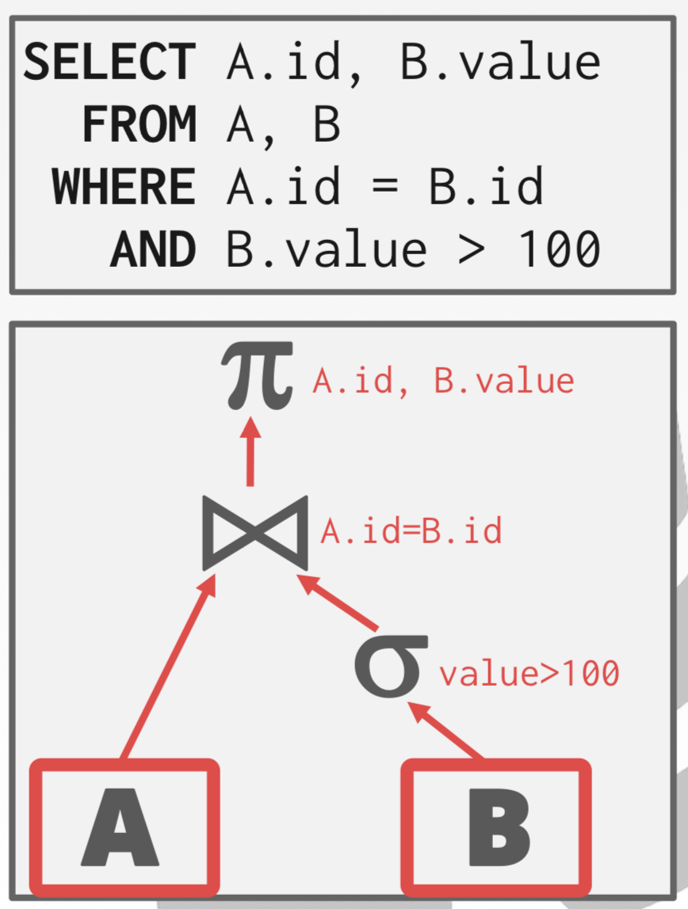
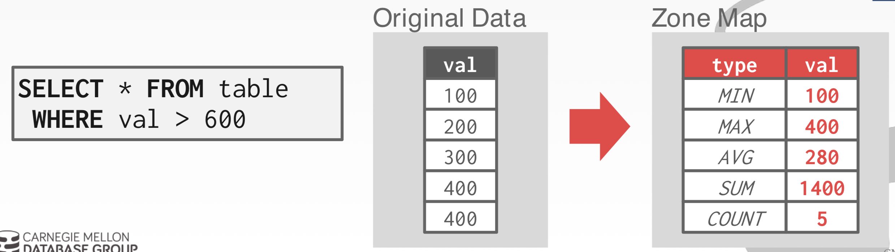
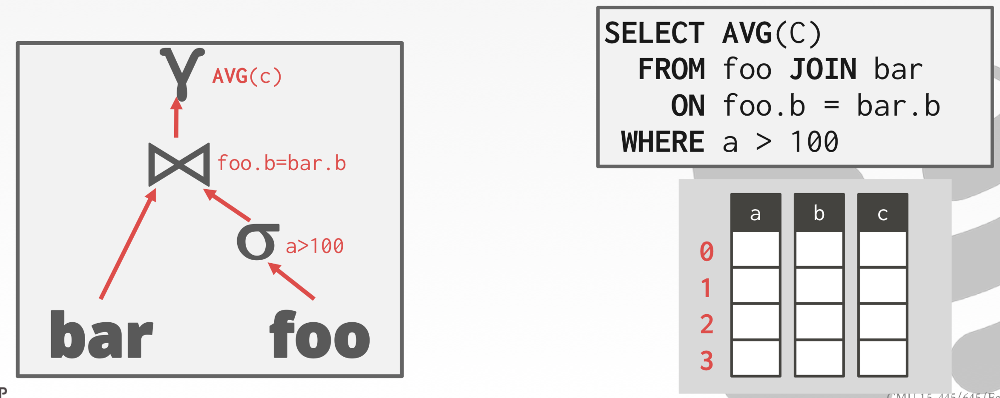
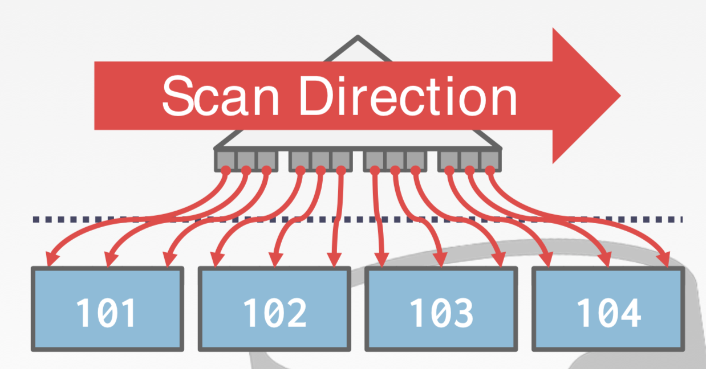
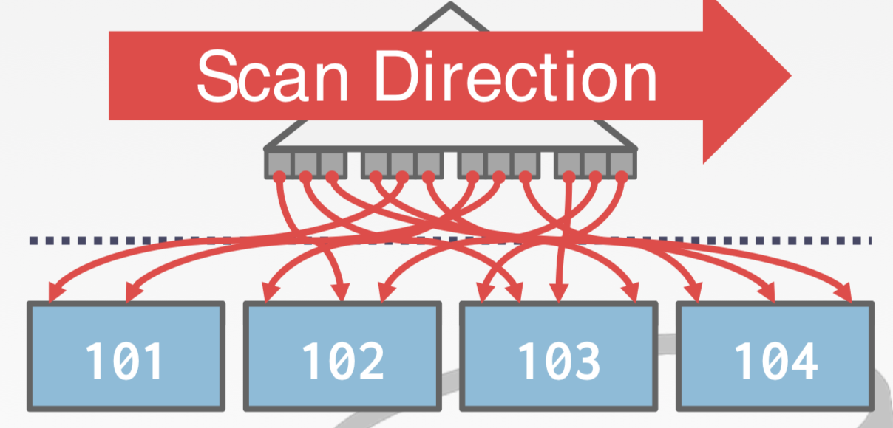
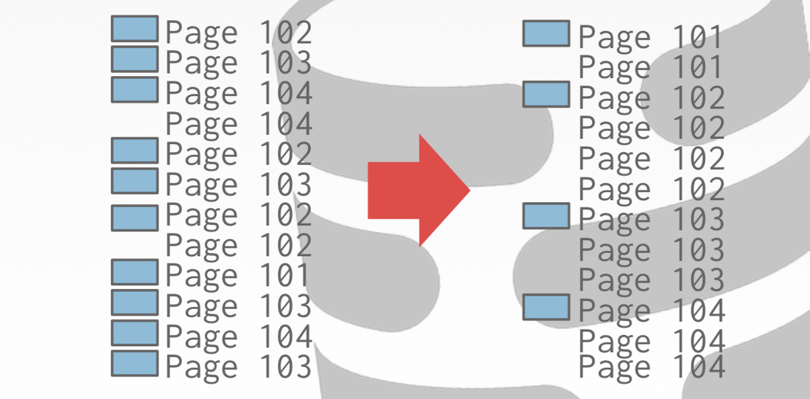

# Query Processing 2

## Access Method

DBMS 가 테이블에 저장되어 있는 데이터에 접근할 수 있게 해주는 방법이다.
* 관계 대수학에 정의되어 있지 않다.

기본 접근
* Sequential Scan
* Index Scan
* Multi-Index / "Bitmap" Scan



## Sequential Scan

각 테이블의 페이지마다...
* Buffer pool 로 가져와 데이터를 탐색
* 각 튜플을 반복(Iterate)해가면서 해당 튜플이 포함되어 있는지를 판단

DBMS 는 마지막으로 탐색한 Page / Slot 을 추적하기 위한 내부 커서를 포함하고 있다.

### Optimization

이것은 DBMS 가 쿼리를 실행시키는 상황에서 거의 항상 최악의 경우에 해당한다.

Sequential Scan Optimizations:
* Prefetching
* Parallelization
* Buffer Pool Bypass
* **Zone Maps**
* **Late Materialization**
* **Heap Clustering**

### Zone Maps

페이지의 속성 값들을 위해 미리 값을 계산해놓는다.
DBMS 는 (쿼리를 가져오기 위해) 해당 페이지의 엑세스가 필요한 지를 우선 Zone Map 을 확인하여 결정한다.



원래 데이터를 가진 페이지와 분리된 다른 페이지에 데이터를 계산하여 저장한다.

데이터의 크기가 작기 때문에 Zone Maps 페이지는 여러 페이지의 값을 한 페이지에 몰아서 저장하는 형태로 이루어져 있다.

오라클, DB2 등에 사용되는 개념이다.

### Late Materialization

쿼리 플랜에서 Materialization 이 동작하는 단게의 offset(실행순서) 를 최대한 뒤로 미루어 적은 middle result 로 columns 를 fetch 해올 수 있도록 한다.
(필요한 컬럼을 lazy 하게 fetch 해온다는 개념인 것 같다)



### Heap Clustering

Clustering Index 에 지정된 기준에 따라 heap 의 페이지 내부의 튜플들을 정렬한다.

만약 쿼리가 클러스터링 인덱스를 이용해 튜플에 접근하면, DBMS 는 필요한 페이지를 건너뛰면서 직접 접근할 수 있다.



## Index Scan

DBMS 에서 쿼리가 필요한 튜플을 찾기 위해 인덱스를 픽한다.

사용하는 인덱스는 다음에 따라 다르다.
* 인덱스를 포함하는 attributes
* 쿼리가 참조하는 attributes
* attributes 의 value domains
* 쿼리 기술의 구성
* 인덱스가 unique 인가 아닌가에 따라

2개의 인덱스 컬럼으로 구성된 하나의 테이블에 100개의 튜플이 저장되어 있다고 가정해보자.
* Index #1: AGE
* Index #2: DEPT

```sql
SELECT *
FROM students
WHERE age < 30
    AND dept = 'CS'
    AND country = 'US'
```

```
시나리오 #1
99명의 사람들이 30세 미만이지만 오직 2명만이 CS 소속이다.

시나리오 #2
99명의 사람들이 CS 소속이지만 오직 2명만이 30세 미만이다.
```

## Multi-Index Scan

만약 DBMS 가 쿼리를 위해 사용할 수 있는 다중 Index 가 있다면
* 각각의 매칭되는 인덱스를 이용해 Record ID 의 셋을 계산한다.
* 쿼리의 기술에 기초해 위의 셋을 결합시킨다(union vs. intersect).
* 결합된 레코드를 탐색한 다음 남은 과정을 진행한다.

OpstgreSQL 은 이것을 Bitmap Scan 이라고 부른다.

위의 상황으로 돌아가서, `AGE` 와 `DEPT` 모두 인덱스가 걸려있다면,
* 우선 `AGE < 30` 에 해당되는 레코드의 ID 를 긁어올 수 있다.
* 그리고 `DEPT = 'CS'` 에 해당되는 레코드 ID 도 긁어온다.
* 그 둘의 교집합을 구한다.
* 결과를 이용해 레코드를 탐색하고 `COUNTRY = 'US'` 를 구한다.

### Index Scan Page Sorting

인덱스는 ID 에 대해 순서가 정해져 있지 않다.
따라서 인덱스 스캔으로 가져온 record ID 셋으로 튜플 스캔을 진행할 때, 페이지 fetch 에 있어 효율적이지 못할 수 있다.



DBMS 는 우선, 필요한 모든 tuple 들을 **조사**하여 그들의 페이지 ID 에 기초해 정렬한다.



