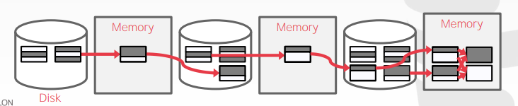
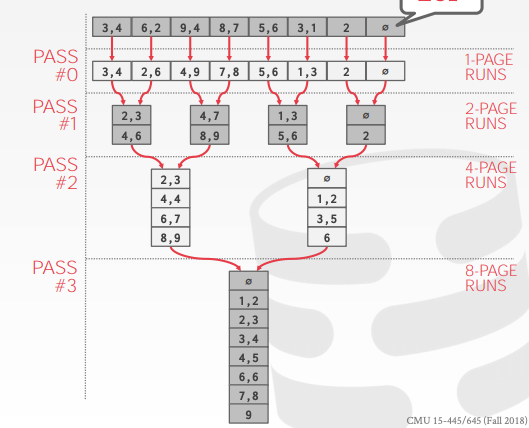

## Why do we need to sort?

테이블의 튜플은 어떠한 순서 정의도 없다.

하지만 사용자는 종종 특정 순서를 기준으로 튜플을 탐색하기를 원한다.
* 중복 제거 등의 사소한 지원 (DISTINCT)
* 정렬된 튜플을 B+ tree 인덱스로 대량 로드하는 것이 더 빠르다.
* Aggregations (GROUP BY)

## Sorting Algorithms

만약 데이터가 메모리에 올릴 수 있다면, 퀵소트와 같이 표준 정렬 알고리즘을 사용하면 된다.

만약 데이터가 메모리에 올릴 수 없다면, 데이터를 디스크에 쓰는 데 들어가는 비용을 인식하는 기술을 사용해야 할 필요가 있다.

## External Merge sort

### Sorting Phase

메인 메모리에 맞는 작은 청크 단위의 데이터를 정렬하고, 정렬된 데이터를 다시 디스크의 파일에 쓴다.

### Merge Phase

정렬된 작은 단위의 서브 파일들을 하나의 단일 파일로 결합시킨다.

### 2-Way External Merge Sort

다음과 같은 조건으로 2-way external merge sort 를 진행한다.
* 파일은 `N` 페이지로 이루어져 있다.
* DBMS 는 한졍되고 고정된 `B` 사이즈의 버퍼를 가지고 있다.

#### Pass #0

* 테이블의 매 `B` 페이지마다 메모리로 읽어들인다.
* 그것을 정렬 후, 다시 디스크에 쓴다.
* 각각의 페이지에 대한 위 과정을 `run` 이라고 정의한다.

### Pass #1, 2, 3, ...

* 재귀적으로 `run` 의 쌍을 두 배의 `run` 으로 병합한다.
* 3개의 버퍼 페이지를 사용하게 된다 (2개의 인풋 페이지, 1개의 아웃풋 페이지)

각각의 Pass 마다, 파일에 있는 각각의 페이지를 읽고 쓰게 된다.
* Number of passes = 1 + (log2N)
* Total I/O Cost = 2N * (# of passes)

이 알고리즘은 오직 3개의 버퍼 페이지(`B`=3)만 필요하다.

더 많은 버퍼 페이지가 사용 가능하지만(`B`>3), 효과적으로 활용하지 못한다.

## General External Merge Sort

### Pass #0

* `B` 버퍼 페이지를 사용한다.
* `N / B` 개수로 `B` 크기의 정렬된 `run` 을 만든다.

### Pass #1, 2, 3, ...

* `B - 1` `run` 들을 병합시킨다. (i.e., K-way merge).

각각의 Pass 마다, 파일에 있는 각각의 페이지를 읽고 쓰게 된다.
* Number pf passes = 1 + (logB-1(N / B))
* Total I/O Cost = 2N * (# of passes)

### Example N=108, B=5

* Pass #0: `N=108 / B=5` = 하나당 5페이지 분량 22개의 `run` 들이 만들어진다. (마지막 `run` 은 3페이지만)
* Pass #1: `N'=22 / B-1=4` = 하나당 20페이지 분량 6개의 `run` 들이 만들어진다. (마지막 `run` 은 8페이지만)
* Pass #2: `N''=6 / B-1=4` = 각각 80페이지와 28페이지 분량 2개의 `run` 들이 만들어진다.
* Pass #3: 정렬된 108페이지의 단일 파일

