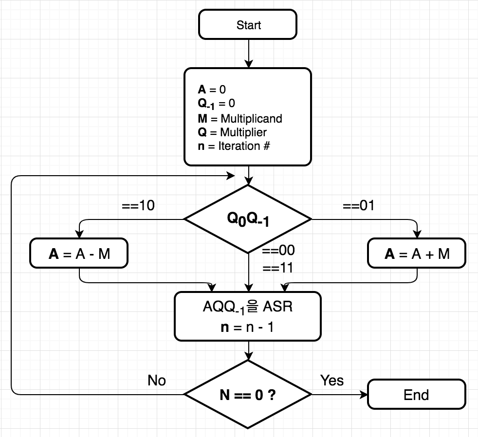
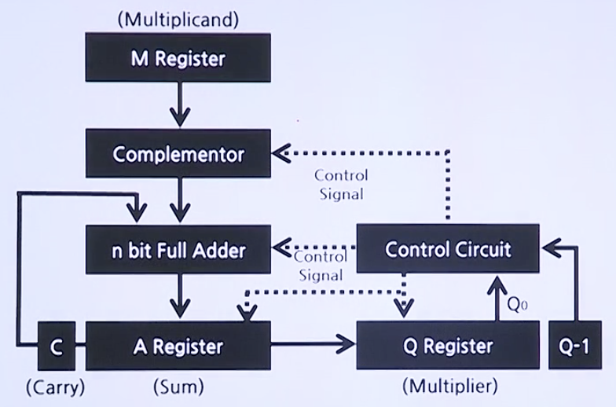

# ALU Architecture와 Integer Representation

## Integer Arithmetic: Signed Multiplication (Booth's Algorithm)

### 개요

| 임의의 Binary #을 Sign에 관계 없이 2의 제곱의 합, 차로 표현 ||||
|---|------|---|-------------------------------------------------|
|   | 0010 | 2 | 22 - 21                   |
| + | 0001 | 1 | 21 - 20                   |
| = | 0011 | 3 | 22 - 20                   |

* 이를 기계적으로 수행하는 방법은 다음과 같다. ex) 00112
    * 0011(0)에서 현재 자릿수 값과 다음 자리수 값

        조건 | 연산
        -----|-----
        00 | 0
        11 | 0
        01 | +
        10 | -

* n Bits * n Bits = 2n Bits
    * 피승: -7 (1001, Multiplicand, 4 Bits, M Register)
    * 승수:  3 (0011, Multiplier, 4 Bits, Q Register)
    * 결과: -21 (11101011, 8 Bits, AQ Register, ADD/SUB & Arith Shift)

* 1001 * 0011 = 1001 * **(0100 - 0001)**

### 연산 과정

#### 1 steps

Carry bit | A Reg | Q Reg | Q-1 | Notes
----------|------:|:------|------|------
0         | 0000  | 001**1** | **0** | 초기 값
0         | 0111  |       |   | 더할 값
0         | 0111  | 0011  | 0 | 더한 값
0         | 0011  | 1001  | 1 | ASR

#### 2 steps

Carry bit | A Reg | Q Reg | Q-1 | Notes
----------|------:|:------|-----|------
0         | 0011  | 100**1** | **1** | 초기 값
0         | 0000  |       |   | 더할 값
0         | 0011  | 1100  | 1 | 더한 값
0         | 0001  | 1100  | 1 | ASR

#### 3 steps

Carry bit | A Reg | Q Reg | Q-1 | Notes
----------|------:|:------|-----|-------
0         | 0001  | 110**0** | **1** | 초기 값
0         | 1001  |       |   | 더할 값
0         | 1010  | 1100  | 1 | 더한 값
0         | 1101  | 0110  | 0 | ASR

#### 4 steps

Carry bit | A Reg | Q Reg | Q-1 | Notes
----------|------:|:------|-----|-------
0         | 1101  | 011**0** | **0** | 초기 값
0         | 0000  |       |   | 더할 값
0         | 1101  | 0110  | 0 | 더한 값
0         | 1110  | 1011  | 0 | ASR

#### Results

* AQ = `11101011`

### 하드웨어 구현

1. 피승수는 M Register에 저장, 필요할 때 마다 n bit Full Adder에 값을 내준다. (상수)
2. Carry bit, A Register에는 초기값으로 0000 취함
3. Q Register에는 초기값으로 승수 저장, Q-1 = 0
4. Control Circuit을 통해 Q0Q-1의 값에 따라 Control signal 보냄
6. Complementor는 받은 신호에 따라 M Register의 값을 받아 2의 보수를 취함
5. n bit Full Adder는 받은 신호에 따라 M Register의 값을 받아 AND 연산후 C, A Register 값과 Full Addition
6. 결과를 다시 A Register에 저장
7. C, A Register, Q Register을 통째로 Logical Shift Right 시킴
* Bit수 만큼 반복