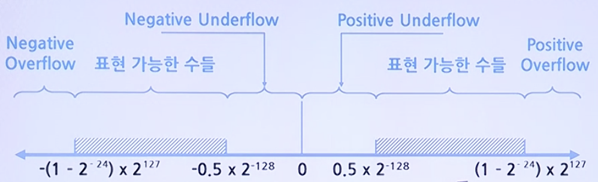

# BFPN(Binary Floating Point #) Representation

## Single Precision BFPN

* 표현 비트: 32 Bits

    31 | 30 ~ 23 | 22 ~ 0 
    ---|---------|--------
    Sign | Exponent (8) | Mantissa(23)
* 기본형: +_0.1M * 2E
* 만일 1.1010 * 24이라면 0.1101 * 25로 정규화
    * S = 0
    * E = 0000 0101 (2's Complement 표현)
    * M = 101 0000 0000 0000 0000 0000 (Unsigned 표현)
* 결국 **S와 M을 합쳐서 Signed Magnitude로 표현**

### 표현가능 범위

## Double Precision BFPN

* Sign = 1 (음수), 0 (양수)
* Mantissa의 범위: **0.5 <= M <= 1** : 정밀도 결졍
* Exponent의 범위: **-27 < E < 27 - 1** : 표현 가능한 수의 범위 결정
* Mantissa와 Exponent간 길이조절 필요

따라서

* 표현 비트: 64 Bits

    63 | 62 ~ 52 | 51 ~ 0 
    ---|---------|--------
    Sign | Exponent (11) | Mantissa(52)

## Single Procision BFPN with Biased Exponent

> Bias = 128일 때, N = -13.625에 대한 BFPN 표현

* 13.62510 = 1101.1012 = 0.1101101 * 24
    * S = 1
    * M = 101 1010 0000 0000 0000 0000 (소수점 우측의 첫번째 1 제외)
    * E = 0000 0100 + 1000 0000 = 1000 0100 (Bias 128을 더함)

    S(1) | E(8) | M (23)
    -----|------|--------
    1 | 1000 0100 | 101 1010 0000 0000 0000 0000

### Why Biased Exponent?

* E의 값의 아주 작은 음수라면 전체 숫자는 거의 0에 가까워짐
    * 0에 대한 표현에서 모든 Bit들이 0이 되게 하여, Zero-Test(ZT)가 정수에서와 같은 방법으로 가능하게 하기 위함
    * If M = 000 0000 0000 0000 0000 0000 then BFPN = 0  
    : 일반적인 정수와 동일한 방법으로 ZT 가능
    * If E = 1000 0000 (BFPN에서 가장 작은 음수) then BFPN = 0  
    : 일반적인 정수와 동일한 방법으로 ZT 불가능
    * If E = 0000 0000 (BFPN with Biased 128에서 가장 작은 음수) then BFPN = 0  
    : 일반적인 정수와 동일한 방법으로 ZT 가능

## IEEE 754 Standard Format

### Format

* Single Precision : N = (-1)S * 2E - 127 * (1.M) -> 1은 Hidden Bits
* Double Precision : N = (-1)S * 2E - 1023 * (1.M)
* Signed Magnitude Representation(Sign + Mantissa), Biased-127/1023 Exponent

### Example

* N = -13.62510 = -1101.1012 = -1.101101 * 23
    S | E | M
    -----|------|--------
    1 | 1000 0010 | 1011 0100 0000 0000 0000 0000

### Exceptions

_ | E | M | Representation
--|---|---|---------------
NaN | E = 255/2047 | M != 0 | N = NaN (0 나누기)
Overflow | E = 255/2047 | M = 0 | N = (-1)S * 무한대 * (1.0)
일반식 | 0 < E < 255/2047 |   | N = (-1)S * 2E - 127/1023 * (1.M)
Underflow | E = 0 | M != 0 | N = (-1)S * 0 * (1.M)
Zero | E = 0 | M = 0 | N = (-1)S * 0
