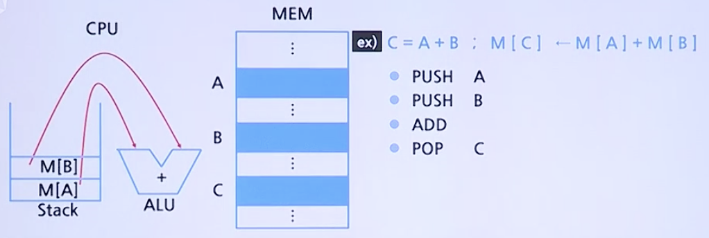

# CPU 기초

## 명령어 세트

### 오퍼랜드의 CPU 기억장소

* 스택(Stack) 아키텍쳐
    
    * 장점
        * 명령어가 짧아 코드 밀도가 높다.
        * 구현 모델이 간단하다.
    * 단점
        * 코드를 생성하는 데 있어서 비효율적이다.
        * 스택에 병목현상이 발생한다.
    
* 누산기(Accumulator) 아키텍쳐
    
    * 장점
        * 명령어가 짧아 코드 밀도가 높다.
        * 단계가 축소되어 복잡하지 않다.
    * 단점
        * 메모리 트래픽이 높다

* 범용 레지스터(GPR) 아키텍쳐
    
    * 장점
        * 현재 대부분의 컴퓨터가 사용한다.
    * 단점
        * 오퍼랜드 코드가 길다
