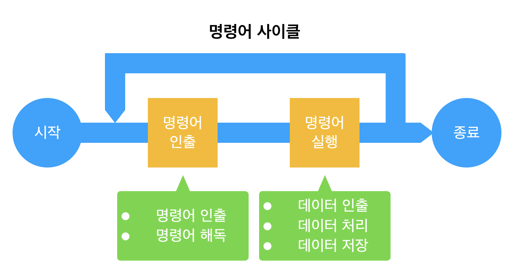
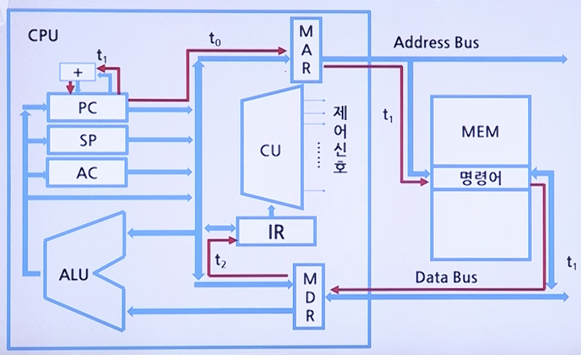

# CPU 기초

## 명령어 사이클

* CPU가 하나의 명령어를 실행하는 데 필요한 전체 처리과정
* CPU가 프로그램 실행을 시작한 후 전원을 끄거나 회복 불가능한 오류가 발생하여 중단될 때까지 주기적으로 계속 반복한다.



### 명령어 인출 사이클

CPU가 주기억장치로부터 지정된 명령어를 읽어오는 단계.

* 명령어 인출(Instruction Fetch)
    * 주기억 장치로부터 지정된 주소에 있는 명령어를 IR로 가져온다.

* 명령어 해독(Instruction Decode)
    * 실행해야 할 동작을 결덩하기 위하여 인출된 명령어를 해독한다.

### 명령어 실행 사이클

명령어 레지스터에 적재된 명령어를 해독한 후, 실행하는 단계

* 데이터 인출(Data Fetch)
    * 명령어 실행을 위해 데이터가 필요한 경우에는 주기억장치 또는 입출력장치로부터 데이터를 가져온다.

* 데이터 처리(Data Process)
    * 데이터에 대한 산술 혹은 논리적 연산을 수행한다.

* 데이터 저장(Data Store)
    * 수행한 결과를 저장장치에 저장한다.

## 명령어 인출 사이클(Instruction Fetch Cycle)

* 인출 명령어 사이클에서 클럭주기(t<sub>0</sub>, t<sub>1</sub>, t<sub>2</sub>)에 따른 흐름도



* **t<sub>0</sub>**: 현재의 PC의 주소 값을 CPU 내부 버스를 통하여 MAR로 전송한다.
* **t<sub>1</sub>**: 그 주소 값이 지정하는 기억장치 주소로부터 읽혀진 명령어를 데이터 버스를 통하여 MDR에 저장하고, PC의 값에 워드의 길이 만큼을 더한다.
* **t<sub>2</sub>**: MDR에 있는 명령어가 명령어 레지스터인 IR로 전송된다.

이를 마이크로 연산(Micro-operation)으로 표현하면 다음과 같다.

```
t_0:    MAR <- PC
t_2:    MAR  <- M[MAR], PC <- PC + 1
t_2:    IR <- MDR
```

