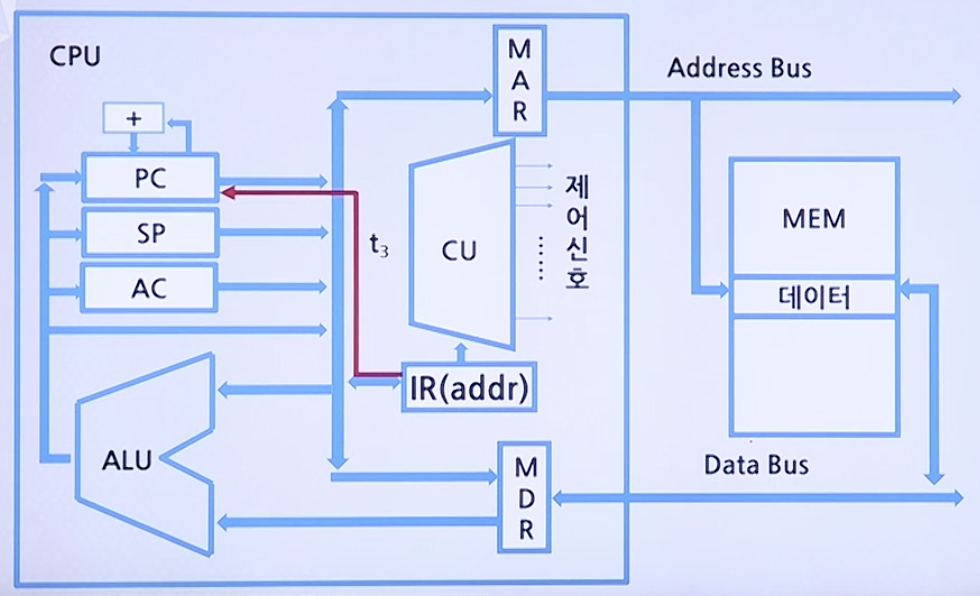

# CPU 기초

## 명령어 실행 사이클 

### LOAD 명령어 사이클에서 클럭주기(t<sub>3</sub>, t<sub>4</sub>, t<sub>5</sub>)에 따른 흐름도


* **t<sub>3</sub>**: 명령어 레지스터인 IR에 있는 명령어의 오퍼랜드(addr) 값을 MAR로 전송한다.
* **t<sub>4</sub>**: 그 주소 값이 지정하는 기억장치 주소로부터 읽혀진 데이터를 데이터 버스를 통하여 MDR에 저장한다.
* **t<sub>5</sub>**: MDR에 있는 데이터는 AC로 저장된다.

이를 마이크로 연산(Micro-operation)으로 표현하면 다음과 같다.

* 주기억 장치에 저장되어 있는 데이터를 CPU 내부 레지스터 AC로 이동하는 명령어

```
t_3:    MAR <- IR(addr)
t_4:    MDR <- M[MAR]
t_5:    AC <- MDR
```

### STORE 명령어 사이클에서 클럭주기(t<sub>3</sub>, t<sub>4</sub>, t<sub>5</sub>)에 따른 흐름도


* **t<sub>3</sub>**: 데이터를 저장할 장소를 지정하는 IR에 있는 명령어의 오퍼랜드(addr) 값을 MAR로 전송한다.
* **t<sub>4</sub>**: 처리된 후, 저장할 데이터를 저장된 AC로부터 버퍼 레지스터인 MDR로 전송한다.
* **t<sub>5</sub>**: MDR의 내용을   MAR이 지정하는 주기억장치의 주소에 저장한다.

이를 마이크로 연산(Micro-operation)으로 표현하면 다음과 같다.

* AC 레지스터의 내용을 주기억장치에 저장하는 명령어

```
t_3:    MAR <- IR(addr)
t_4:    MDR <- AC
t_5:    M[MAR] <- MDR
```

### ADD 명령어 사이클에서 클럭주기(t<sub>3</sub>, t<sub>4</sub>, t<sub>5</sub>)에 따른 흐름도


* **t<sub>3</sub>**: 명령어 레지스터인 IR에 있는 명령어의 오퍼랜드(addr) 값을 MAR로 전송한다.
* **t<sub>4</sub>**: 그 주소 값이 지정하는 기억장치 주소로부터 읽혀진 데이터를 데이터 버스를 통하여 MDR에 저장한다.
* **t<sub>5</sub>**: 전송된 MDR의 데이터와 AC의 내용을 덧셈 연산 후, 그 결과값을 다시 AC로 저장한다.

이를 마이크로 연산(Micro-operation)으로 표현하면 다음과 같다.

* 주기억장치로부터 가져온 데이터를 AC의 내용과 덧셈 연산 후 그 결과를 다시 AC에 저장하는 명령어

```
t_3:    MAR <- IR(addr)
t_4:    MDR <- M[MAR]
t_5:    AC <- AC + MDR
```

### JUMP 명령어 사이클에서 클럭주기(t<sub>3</sub>)에 따른 흐름도



* **t<sub>3</sub>**: 명령어의 오퍼랜드(분기할 목적지 주소)가 PC에 자장됨으로써 다음 명령어를 인출하는 사이클에서 변경된 주소의 명령어가 인출되므로 결과적으로 프로그램 실행 순서를 변경(분기)하는 것이다.

이를 마이크로 연산(Micro-operation)으로 표현하면 다음과 같다.

* 주기억장치로부터 가져온 데이터를 AC의 내용과 덧셈 연산 후 그 결과를 다시 AC에 저장하는 명령어

```
t_3:    PC <- IR(addr)
```