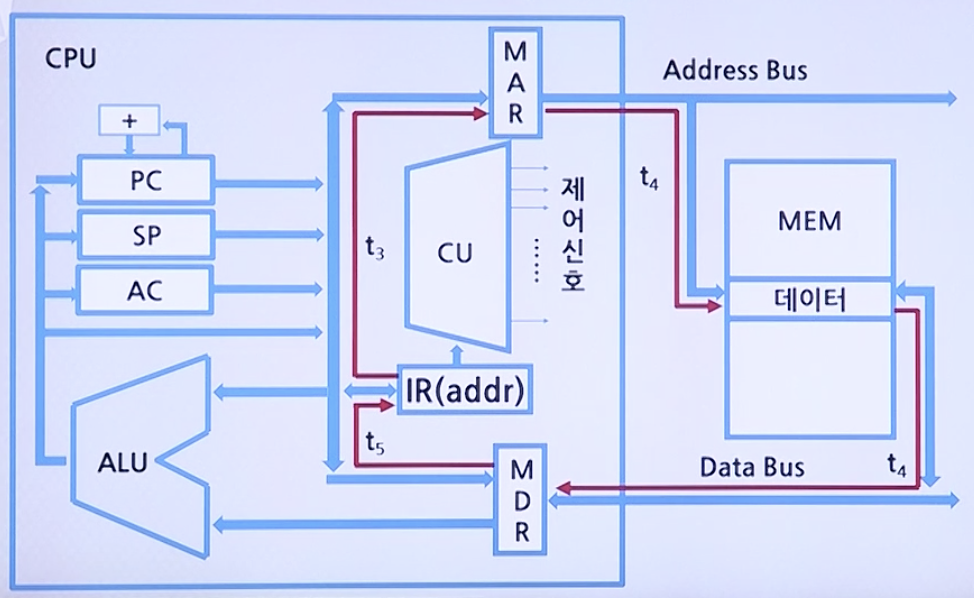

# CPU 기초

## 명령어 실행 사이클(Indirect Cycle)

### 간접 사이클에서 클럭주기(t<sub>3</sub>, t<sub>4</sub>, t<sub>5</sub>)에 따른 읽혀 올 유효주소의 흐름도



* **t<sub>3</sub>**: 명령어 레지스터인 IR에 있는 명령어의 오퍼랜드(addr) 값을 MAR로 전송한다.
* **t<sub>4</sub>**: 그 주소 값이 지정하는 기억장치 주소로부터 읽혀진 데이터를 데이터 버스를 통하여 MDR에 저장한다.
* **t<sub>5</sub>**: 전송된 MDR의 데이터는 유효주소 정보이기에 그 값을 다시 IR의 Address 필드로 전송한다.

이를 마이크로 연산(Micro-operation)으로 표현하면 다음과 같다.

* 명령어에 포함되어 있는 주소정보를 이용하여, 실제 명령어 실행에 필요한 데이터를 인출하는 사이클로서 간접 주소지정 방식에서 사용되며, 이것은 인출 사이클과 실행 사이클 중간에 실행된다.

```
t_3:    MAR <- IR(addr)
t_4:    MDR <- M[MAR]
t_5:    IR(addr) <- MDR
```

## 여러 명령어의 종합적인 실행과정(예제)

### 예제 어셈블리 프로그램

주소(Address) | 명령어(Instruction) | 기계 코드(Machine Code)
--------------|---------------------|-------------------------
100 | LOAD 250 | 1250
101 | ADD 251 | 5251
102 | STORE 251 | 2251
103 | JUMP 170 | 8170

### 실행 과정 마이크로 연산

```
# 100번지 명령어(`LOAD 250`) 인출

t_0:    MAR <- PC
t_1:    MAR  <- M[MAR], PC <- PC + 1
t_2:    IR <- MDR

# `LOAD 250` 실행(간접사이클)

t_3~5:  IR(addr) <- M[IR(addr)]

t_6:    MAR <- IR(addr)
t_7:    MDR <- M[MAR]
t_8:    AC <- MDR

# 101번지 명령어(`ADD 251`) 인출

t_9:    MAR <- PC
t_10:   MAR  <- M[MAR], PC <- PC + 1
t_11:   IR <- MDR

# `ADD 251` 실행(간접사이클)

t_12~15:IR(addr) <- M[IR(addr)]

t_16:    MAR <- IR(addr)
t_17:   MDR <- M[MAR]
t_18:   AC <- AC + MDR

# 102번지 명령어(`STORE 251`) 인출

t_19:   MAR <- PC
t_20:   MAR  <- M[MAR], PC <- PC + 1
t_21:   IR <- MDR

# `STORE 251` 실행

t_22:   MAR <- IR(addr)
t_23:   MDR <- AC
t_24:   M[MAR] <- MDR

# 103번지 명령어(`JUMP 170`) 인출

t_25:   MAR <- PC
t_26:   MAR  <- M[MAR], PC <- PC + 1
t_27:   IR <- MDR

# `JUMP 170` 실행

t_28:    PC <- IR(addr)
```

### 실행소요시간

* CPU 클럭 수: 2GHz
* 메모리 지연시간 X

라고 가정할 시

* 클럭 주기 = 1sec. / 2 * 10<sup>9</sup> = 0.5ns
* 전체 소요 클럭 수 : 28 클럭
    * LOAD: 인출(3) + 간접(3) + 실행(3) = 9 클럭
    * ADD:  인출(3) + 간접(3) + 실행(3) = 9 클럭
    * STORE:인출(3) + 간접(0) + 실행(3) = 6 클럭
    * JUMP: 인출(3) + 간접(0) + 실행(1) = 4 클럭
* 전체 실행시간: 0.5ns * 28 클럭 = 14.0ns