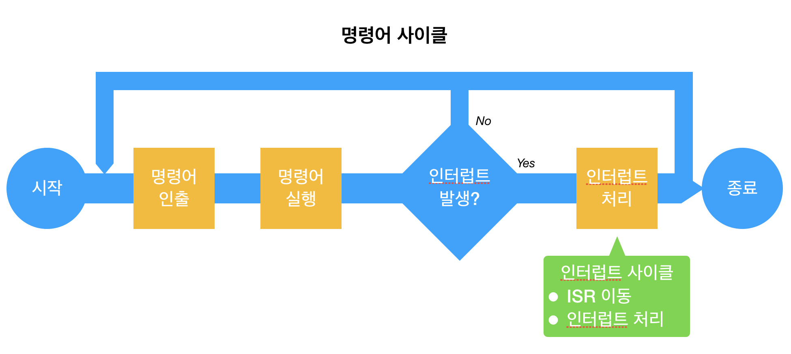
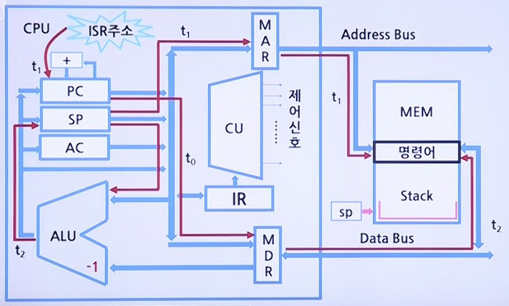

# CPU 기초

## 인터럽트(Interrupt)



### 인터럽트란?

> CPU가 정상적인 프로그램 실행 중에 또 다른 프로그램의 실행 요구로 현재 실행 중인 프로그램을 중단시키고 요구된 프로그램을 실행하는 것을 인터럽트라고 한다.

* CPU가 프로그램 실행 중에 인터럽트 신호 처리를 요청
    * CPU는 원래의 프로그램 수행을 중단한다.
    * 요구된 인터럽트를 위한 서비스 프로그램을 먼저 수행한다.
        * 어떤 장치가 인터럽트를 요구했는지 확인한다.
        * 해당 인터럽트 서비스 루틴을 호출한다.
    * 인터럽트 처리가 끝나면 본 프로그램으로 복귀한다.

### 인터럽트 사이클(Interrupt Cycle)

* 인터럽트 사이클에서 클럭주기(t<sub>0</sub>, t<sub>1</sub>, t<sub>2</sub>)에 따른 주소값 및 명령어의 흐름도



* **t<sub>0</sub>**: 현재 PC의 주소정보를 MDR로 전송한다.
* **t<sub>1</sub>**: SP의 내용의 MAR로 전송되고 PC의 내용은 인터럽트 서비스 루틴의 시작 주소로 변경된다.
* **t<sub>2</sub>**: MDR에 저장되어 있던 원래 PC의 내용이 스택에 저장된다.

이를 마이크로 연산(Micro-operation)으로 표현하면 다음과 같다.

```
t_0:    MDR <- PC
t_1:    MAR <- SP, PC <- ISR시작주소
t_2:    M[MAR] <- MDR, SP <- SP - 1
```

### 다중 인터럽트(Multiple Interrupt)

> 인터럽트 서비스 루틴을 수행하는 동안에 또 다른 인터럽트가 발생하는 것을 말한다.

* 다중 인터럽트의 처리방식
    * 인터럽트 플래그(Interrupt Flag)를 이용하는 방식
        * CPU가 인터럽트 요청을 처리하는 도중에 새로운 인터럽트 요청이 발생하더라도 이를 수행하지 않도록 하는 방식이다.
        * 이 때 새로운 인터럽트 요청은 플래그를 불가능(Disabled) 상태로 설정하고, 대기 상태로 설정한다.
        * 이것은 가능(Enable) 상태로 변경되면 그 때 인식된다.
        * 시스템 운영상 중요한 프로그램 수행이나, 도중에 중단할 수 없는 데이터 입출력 동작 등을 위한 인터럽트를 처리하는 데 주로 사용한다.
    
    * 우선순위(Priority)를 정하는 방식
        * 우선순위가 낮은 인터럽트 요청을 처리하는 동안에 우선순위가 더 높은 인터럽트 요청이 들어오면, 현재 진행되는 낮은 순위의 요청은 중단되고 높은 순위의 요청이 처리되도록 하는 방식이다.