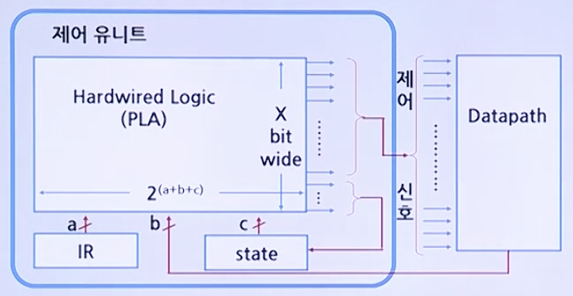
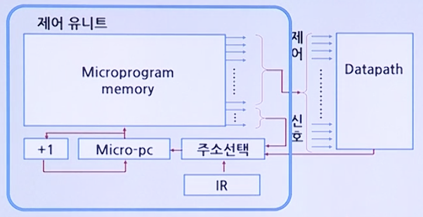

# CPU 기초

## 제어유닛(Control Unit) 

### 하드와이어 제어(Hardwired Control)

* 복잡한 Datapath -> 복잡한 제어 설계 -> 복잡한 프로세서 설계
* 명령어 세트 설계의 단순화 -> 제어 과정을 단순화
* 제어 유닛은 모든 명령어를 수행함에 있어서 매 클럭 주기마다 Datapath가 해야 핳 일을 정한다.
* 이 과정을 특정화하여 표현한 것이 Finite-state diagram이다.
* 각 state마다 1클럭 소요되므로 명령어 수행은 다수의 state로 완료된다.
* Complexity of Control = State * Control inputs * Control outputs
* 입력: IR(function) + Datapath(condition) + state의 수
* 출력: X bit 패턴 구성

### 마이크로프로그램 제어(Microprogrammed Control)

* 제어 유닛 -> datapath 제어용 축소된 컴퓨터(miniature computer)
* 프로그램 내장형 컴퓨터(stored-program computer)
* mcroprogramming -> microinstruction, microcode, mcroprogram
* 제어신호 그룹 -> 필드(비트패턴) -> microinstruction format
* 프로그래밍 -> 주소체계 유지, 조건점프 등등
* 명령어에 해당되는 각각의 마이크로-연산을 제어 메모리(ROM)의 할당된 주소에 한 개씩 microcode(비트패턴)로 작성된다.

