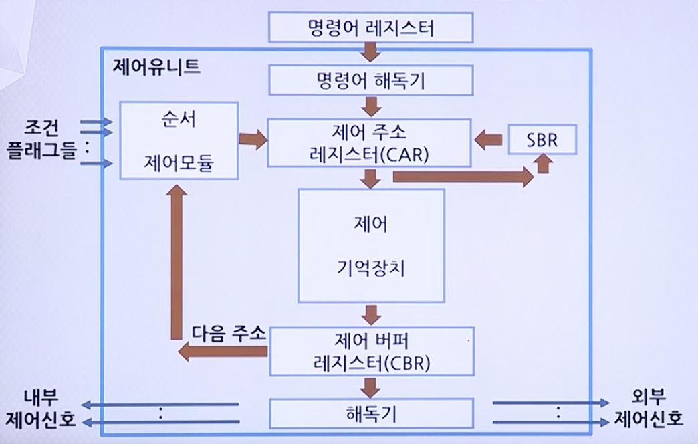

# CPU 기초

## 제어유닛(마이크로프로그램 제어)의 기능

* 명령어 코드의 해독
* 해독 후 명령어 실행에 필요한 각종 제어 신호들을 발생

### 제어 신호

* 마이크로명령어(microinstruction)
    * 명령어 사이클의 각 주기에 실행되는 마이크로-연산에 대응되는 비트들로 이루어진 단어
    * 이들은 모든 Datapath의 제어신호를 나타냄
    * 다음에 수행될 또다른 마이크로명령어를 결정한다.
    * 제어 단어(Control word)라고도 함

* 마이크로코드(microcode)
    * 마이크로 명령어 형식에 따라 각 필드에 2진수로 이루어진 비트패턴

### 마이크로프로그램

* 마이크로프로그램(microprogram)
    * 마이크로 명령어의 집합
    * 명령어 해석기
    * 이것은 하드웨어 변경 없이 컴퓨터 시스템 제어의 수정 가능

* 마이크로서브루틴(microsubroutine)
    * 공통 루틴(common routine)
    * 마이크로명령어의 그룹
        -> 인출, 실행, ...
    * 하드웨어 비용 감소

## 제어 유닛(마이크로프로그램 제어)의 구조

* 명령어 해독기(Instruction Decoder)
    * 명령어 레지스터(IR)로부터 읽혀진 Op-code를 해독한다.
    * 헤독된 연산을 실행하기 위한 마이크로서브루틴의 시작주소를 결정한다.

* 제어 주소 레지스터(Control Address Register)
    * 다음 번에 실행할 마이크로명령어의 주소 정보가 저장되는 레지스터이다.
    * 주소는 제어 기억장치의 위치를 말한다.

* 제어 기억장치(Control Memory)
    * 마이크로명령어들로 이루어진 마이크로프로그램을 저장하는 내부 기억장치이다.

* 제어 버퍼 레지스터(Control Buffer Register)
    * 제어 기억장치로부터 읽혀진 마이크로 명령어를 일시적으로 저장하는 레지스터이다.

* 서브루틴 레지스터(Subroutine Register)
    * 마이크로프로그램에서 서브루틴이 호출되는 경우에 현재 제어 주소 레지스터(CAR) 내용을 일시적으로 저장하는 레지스터이다.

* 순서제어 모듈(Sequencing Module)
    * 마이크로명령어의 실행 순서를 결정하는 회로들의 집합이다.

