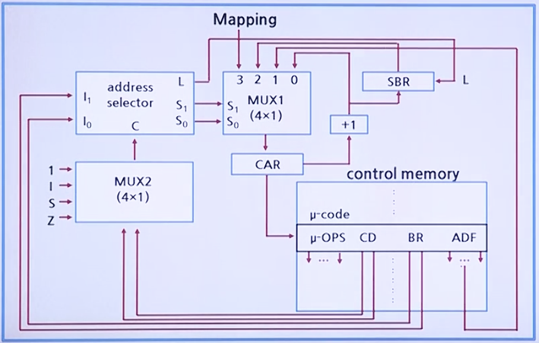

# CPU 기초

## 마이크로프로그램 실행 순서제어(Sequencing Control)

* 제어 유닛이 마이크로명령어의 실행을 제어한다.
* 제어 기억장치에 저장된 마이크로명령어들을 작성된 마이크로프로그램에 따라 순서대로 인출하는 과정을 말한다.
* CAR의 초기값으로 시작해서 다음 차례에 실행할 마이크로 명령어의 주소 값을 결정하는 것을 말한다.
* MAR의 초기 값은 "0"으로 설정한다.
* MUX1 에서는 다음 차례에 실행될 마이크로명령어의 주소를 4종류 중에서 마이크로명령어의 조건에 따라 1종류를 선택한다.
* MUX2 에서는 분기할 조건을 선택하여 주소 선택 회로로 그 값을 전송한다.

### 마이크로프로그램의 실행순서제어 과정

### 제어 기억장치의 마이크로명령어의 주소 선택 방법

* **JMP(00)** 혹은 **CALL(01)**:
    * C=0: 다음 차례의 마이크로명령어 주소를 선택
    * C=1: 주소 필드(ADF)가 지정하는 주소로 점프(JMP) 혹은 호출(CALL)한다.
    * 단, 호출 시에는 원래 CAR 정보를 SBR에 저장한다.

* **RET(10)**: 호출한 마이크로명령어의 다음 주소 값을 저장하고 있는 SBR 정보를 CAR로 전송한다.
* **MAP(11)**: 사상함수의 결과 주소값을 CAR에 전송

### 제어 장치의 마이크로명령어의 주소 선택 회로의 입력 및 출력

> 제어 기억장치로부터 읽혀진 마이크로 명령어의 연산 필드의 비트들은 모두 각종 CPU 동작을 위한 제어 신호가 된다.

l1 | l0 | C | S1 | S0 | L | MUX1's output | Description
--------------|---------------|---|---------------|----------------|---|---------------|------------
0 | 0 | 0 | 0 | 0 | 0 | 0 | CAR <- CAR + 1
0 | 0 | 1 | 0 | 1 | 0 | 1 | CAR <- ADF
0 | 1 | 0 | 0 | 0 | 0 | 0 | CAR <- CAR + 1
0 | 1 | 1 | 0 | 1 | 1 | 1 | SBR <- CAR + 1 CAR <- ADF
1 | 0 | X^ | 1 | 0 | 0 | 2 | CAR <- SBR
1 | 1 | X^ | 1 | 1 | 0 | 3 | CAR <- 1XXXX00^

* X^ 는 don't care bit, XXXX^ 는 명령어의 op-code