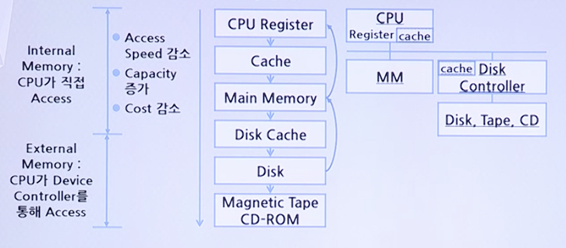

# Main Memory

## Memory Hierarchy

### Principle of Locality

* Memory의 Access가 몇몇 특정 영역에 집중되는 현상
* 짧은 시간을 기준으로 보면 Processor가 Memory의 한정된 위치들만을 Access하면서 작업을 수행
* 이 원리가 적용되는 데이터에 대해 Hierarchical Memory를 사용할 경우 최저 비용으로 최고 성능을 얻을 수 있음

### Hierarchical Memory System

* Memory의 성능 대 가격 비(Performance/Cost Ratio)를 향상시키기 위해 한 System 내에 다양한 종류의 Memory들을 사용하는 방식
* CPU에 가까운 Memory: 속도가 빠르나, 가격은 높은 Memory 사용
* CPU에 먼 Memory: 속도가 느리지만, 가격은 낮은 Memory 사용

### Hierarchical Memory System의 효과

* Average Access Time이 빨라짐

#### 예시)
* Main Memory의 Access 시간 = `50ns`
* Secondary Storage Device의 Access 시간 = `500ns`
* Access할 정보가 Main Memory에 있을 확률 = `n`
* Average Memory Access Time = `(n * 50ns) + (n * 500ns)`
* Data가 Main Memory에 있는 비율에 따른 Average Access Time의 변화
    비율 | 20% | 40% | 60% | 80% | 100%
    -----|-----|-----|-----|-----|-----
    Average Access Time | 410ns | 320ns | 230ns | 140ns | 50ns