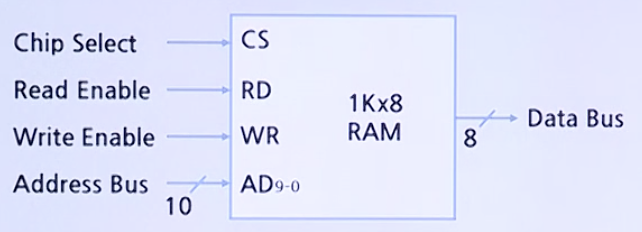
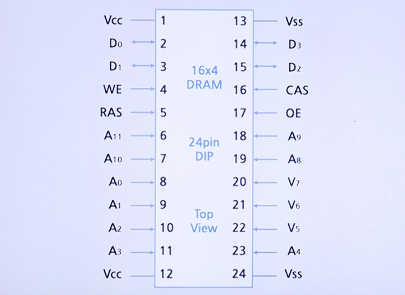
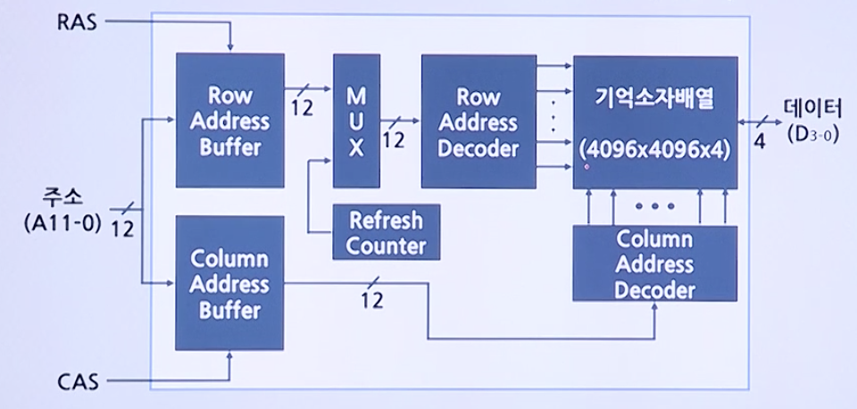

# Main Memory

## 반도체(Semiconductor) Memory - RAM

### 제조기술에 따른 분류

종류 | DRAM(Dynamic RAM) | SRAM(Static RAM)
-----|-------------------|-----------------
저장방식 | IC회로에서 Capacitor에 주기적으로 Charge를 재충전하여 Data를 저장 | 기억 소자로서 Flip-Flop을 이용
밀도 | 집적밀도가 높음 | 집적밀도가 낮음
Refresh 여부 | Data의 저장 상태를 유지하기 위하여 주기적인 Refresh 필요 | 전력이 공급되는 동안에는 재충전 없이도 Data 유지
가격 | 낮음 | 높음
속도 | 느림 | 빠름
용도 | 높은 용량이 필요한 Main Memory로 사용 | 높은 속도가 필요한 Cache 로 사용

### RAM칩의 구조

#### 외부 구조

* 예) Capacity가 `1K(Addressable Unit의 개수)` * `8 Bits(Unit of Transfer)`인 RAM Chip의 Control Signal들

CS | RD | WR | RAM 동작
---|----|----|---------
0 | X | X | 선택되지 않음
1 | 1 | 0 | 읽기
1 | 0 | 1 | 쓰기

#### 내부 구조

* 예) 64 Bits RAM (8 * 8 조직)

### 실제 DRAM의 구성 및 동작타이밍 (16M * 4 조직)

#### 외부 구조

* **Vcc**: 전원(+)
* **Vss**: 전원(-)
* **D0 ~ D3**: Data Bus
* **A0 ~ A11**: Address Bus (폭이 24 bit여야 하지만 Row, Column으로 나눔)
* **RAS**: Row Address 선택시 Enable
* **CAS**: Column Address 선택시 Enable
* **WE**: Write Enable
* **OE**: Output Enable

#### 내부 구조

* 재충전회로: MM Access가 수행되지 않는 동안 동시선택 재충전
* 전체 24 Bits의 Address Line들이 필요
    * RAS(Row Address Strobe)신호와 CAS(Column Address Strobe)신호를 이용하므로 실제로는 Address Line을 12개만 사용
