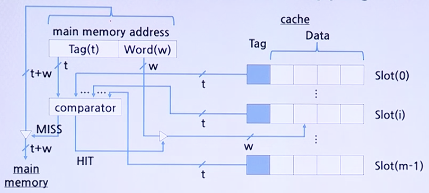
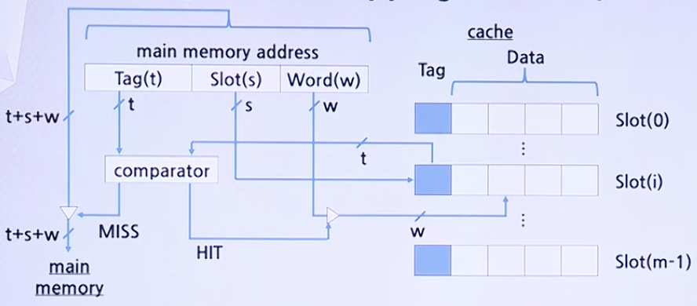
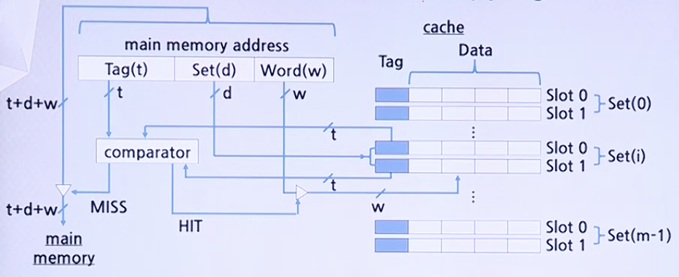

# Cache

## Mapping

* Mapping
    * 어떤 MM 의 Block들이 **어느 Cache Slot을 Share할 것인지를 결정**해 주는 방법
    * `00000`부터 `11111`까지의 번호(MM의 주소)가 할당된 32번의 학생(MM에 저장된 데이터)이 `000`부터 `111`까지의 슬롯(or 세트)번호가 적혀있는 8개의 칸막이 화장실(Cache)을 공평하게 이용하는 방법

1. Fully-Assosiative Mapping:
    * 32명중 급한 학생은 누구나 8개의 칸막이 화장실 중 하나를 점유하게 하는 방법
    * 화장실을 사용할 때 학생들의 번호(`00000`-`11111`: Tag)를 화장실 문에 고지하여 개인을 확인
    * 
        * 새로운 Block이 Cache로 적재될 때 Slot의 선택이 매우 자유로움
        * Locality가 높다면, Hit Ratio가 매우 높음
        * Cache Slot들의 Tag들을 병렬로 검사하기 위하여 매우 복잡하고 비용이 높은 회로가 필요함

2. Direct Mapping:
    * 32명의 학생을 4명씩 8개의 그룹으로 나누고 각 그룹이 사용할 수 있는 화장실을 하나씩 할당하는 방법
    * 화장실을 사용할 때 학생들의 번호 중 앞 두자리(`00`-`11`: Tag)를 화장실 문에 고지하고 칸막이 화장실 번호(`000`-`111`: Slot)와 붙여서 개인을 확인
    * 
        * 하드웨어가 간단하고, 구현 비용이 적게 들음
        * 각 MM Block이 적재돌 수 있는 Cache Slot이 한 개뿐이기 떄문에 그 Slot을 공유하는 다른 블록이 적재되는 경우에는 **Swap-out** 됨

3. Set-Assosiative Mapping:
    * 두 가지 방식의 혼합으로서 32명의 학생을 8명씩 4개의 그룹으로 나누고 각 그룹이 사용할 수 있는 화장실을 두개씩 할당하는 방법
    * 화장실을 사용할 때 학생들의 번호 중, 앞 세자리(`000`-`111`: Tag)를 화장실 문에 고지하고 칸막이 화장실 번호(`00`-`11`: Set)와 붙여서 개인을 확인
    * 
        * Fully Assosiative Mapping과 Direct Mapping 방식의 절충