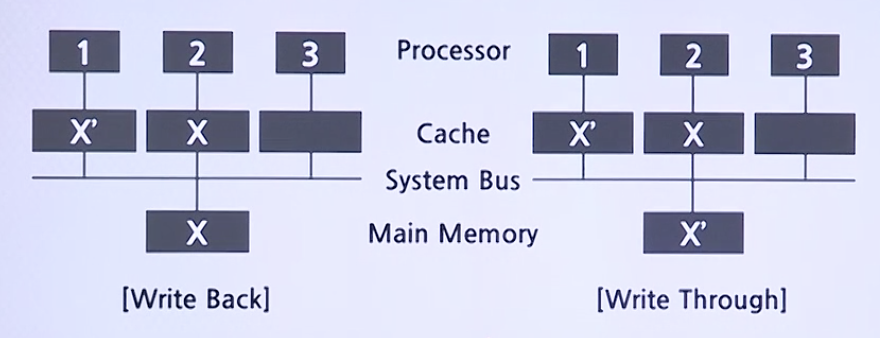

# Cache

## Replace Algorithm

* Direct Mapping은 해당사항 없음
* Replace Algorithm: Cache Hit Ratio를 극대화할 수 있도록 교체할 Block을 선택하기 위한 Algorithm
    * **Least Recently Used(LRU) Algorithm**: 사용되지 않은 채로 가장 오래 있었던 Block을 교체하는 방식
    * **First in First Out(FIFO) Algorithm**: Cache에 적재된 지 가장 오래된 Block을 교체하는 방식
    * **Least Frequently Used(LFU) Algorithm**: 참조되었던 횟수가 가장 적은 Block을 교체하는 방식

## Write Policy

* Cache의 Block이 변경되었을때 그 내용을 Main Memory에 업데이트하는 시기와 방법을 결정

### Wirte Policy의 종류

* Write-through
    * 모든 Write 동작들이 Cache뿐만 아니라 MM로도 동시 수행
    * Cache에 적재된 Block의 내용과 MM에 있는 그 Block의 내용이 항상 같음
    * 모든 Write 동작이 MM Write를 포함하므로 Write 시간이 길어짐

* Write-back
    * Cache에서 Data가 변경되어도 MM에는 Update되지 않는 방식
    * MM에 대한 Write동작의 횟수가 최소화되고 Write Time이 짧아짐
    * Block을 교체할 때는 Cache의 상태를 확인하여 MM을 Update하는 동작이 선행되어야 하며, 그를 위하여 각 Cache Slot이 상태 Bits를 가지고 있어야 함

### Multiple Processor System에서의 Data Inconsistency

* MM에 있는 Block의 내용과 Cache Slot에 적재된 복사본들간의 내용이 서로 달라지는 문제를 의미
