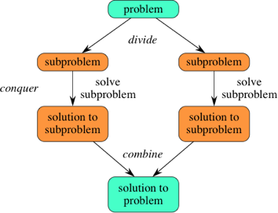

# Divide and Conquer algorithms

## 분할정복이란

> 한 문제를 유형이 비슷한 여러 개의 하위 문제로 나누어 재귀적으로 해결하고 이를 합쳐 원래 문제를 해결하는 패러다임

 하위 문제를 재귀적으로 해결하기 때문에 하위 문제 각각은 원래 문제보다 범위가 작아야 하며, 하위 문제는 각 문제마다 탈출 조건이 존재해야 한다.

 다음과 같이 3부분으로 나누어 생각할 수 있다.

 * **분할**: 원래 문제를 분할하여 비슷한 유형의 더 작은 하위 문제들로 나눈다.
 * **정복**: 하위 문제 각각을 재귀적으로 해결한다. 하위 문제의 규모가 충분히 작으면 문제를 탈출 조건으로 놓고 해결한다.
 * **합치기**: 하위 문제들의 답을 합쳐서 원래 문제를 해결한다.

이와 같은 과정을 그림으로 표현하면 다음과 같다.

재귀적 문제를 두개 더 확장할 경우 다음과 같이 표현할 수 있다.

