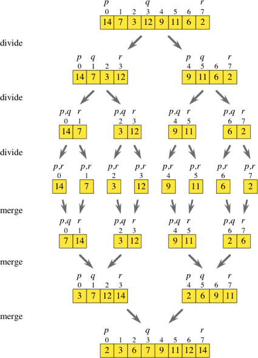

# Merge sort

## 병합정렬이란?

* 분할정복 알고리즘중 하나
* 일반적인 구현으로 `O(n log n)`의 속도를 낸다.

분할정복 알고리즘의 특징을 미루어 생각해보면 궁극적인 목표는 전체 배열을 정렬하는 것이며 그에 따른 하위 문제는 **하위 배열을 정렬하는것**으로 생각할 수 있다.

하위문제를 인덱스 `p`에서 시작해서 인덱스 `r`까지 정렬해야 하는 문제로 간주할 때 분할정복 알고리즘을 어떻게 사용하는지 알아보면

1. **분할**: `p`와 `r`의 중간 `q`를 찾는다. `p`와 `r`을 더해서 2로 나눈 후 내림을 하여 정수로 만든다.
2. **정복**: 분할 단계에서 만들어진 두 하위 문제 각각에 있는 하위 배열을 재귀적으로 정렬한다. 즉, 하위 배열 `array[p..q]`를 재귀적으로 정렬하고 또 하위 배열 `array[q+1..r]`을 재귀적으로 정렬한다.
3. **합치기**: 정렬된 두 하위 배열을 하나의 정렬된 하위 배열인 `array[p..r]`로 결합한다.

와 같이 정리할 수 있다.

또한, 탈출 조건은 2개 미만의 요소가 포함된 하위 배열로, 이는 `p >= r`인 경우 탈출하는 조건을 가지기에 `p < r`일 때만 분할-정복-결합 과정을 거친다.

다음과 같은 과정을 그림으로 나타내면 다음과 같다.



## 병합정렬 구현하기

```py
def merge_sort(lst):
    # q < r 일때 == lst 요소가 2개 이상일때
    if len(lst) > 1:
        # lst의 중간 인덱스
        q = len(lst) // 2

        l = merge_sort(lst[:q])
        r = merge_sort(lst[q:])

        # 하위배열 병합
        return merge(l, r)
    else:
        return lst

def merge(l1, l2):
    # l1과 l2에 대한 카운터 선언
    c1 = 0
    c2 = 0

    # 새 리스트
    lst = []
    
    # 각 카운터가 각 배열 길이를 넘지 않는 동안
    while (c1 < len(l1)) & (c2 < len(l2)):

        # 현재 l1의 c1째 요소가
        # l2의 c2째 요소보다 작으면
        if l1[c1] < l2[c2]:

            # 새 리스트에 먼저 추가후 카운터 증가
            lst.append(l1[c1])
            c1 += 1
        else:
            lst.append(l2[c2])
            c2 += 1

    # 두 리스트 중 하나의 카운터가 먼자 끝나면
    # 나머지 리스트의 요소를 전부 추가
    while (c1 < len(l1)):
        lst.append(l1[c1])
        c1 += 1

    while (c2 < len(l2)):
        lst.append(l2[c2])
        c2 += 1

    return lst
```