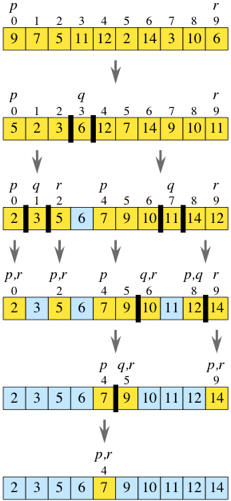

# Quick sort

## 퀵정렬이란

* 분할정복 전략을 사용하는 재귀 알고리즘 중 하나 
* 병합정렬처럼 중요한 작업이 결합 단계에서 일어나는 것과는 달리, 퀵정렬은 모든 중요한 작업은 분할 단계에서 일어난다.
* 정렬이 제자리에서 수행된다.

병합 정렬에서 했던 것 처럼, 최초의 하위 배열이 `array[0..n-1]`인 하위 배열 `array[p..r]`을 정렬한다고 가정했을 때 퀵정렬이 사용하는 분할정복 전략은 다음과 같다.

## 퀵정렬 구현

1. **분할**: 하위배열 `array[p..r]`에서 아무 요소를 골라 **분할**한다. 이 요소를 **피벗(pivot)** 이라 한다. `array[p.. r]` 안의 요소들을 재배열하여 `array[p..r]` 안의 모든 요소 중 피벗보다 작거나 같은 요소는 피벗의 왼쪽으로 보내고, 나머지 요소는 모두 오른쪽으로 보낸다. 이 과정을 **파티션 하기** 라 한다.

2. **정복**: `array[p..q-1]` (피벗보다 작거나 같은, 즉 피벗의 왼쪽에 있는 모든 요소들)과 `array[q+1..r]` (피벗보다 큰, 즉 피벗의 오른쪽에 있는 모든 요소들)을 재귀적으로 정렬하여 정복한다.

3. **합치기**: 아무것도 하지 않으므로써 결합한다.

다음과 같은 과정을 그림으로 나타내면 다음과 같다.



## 코드 구현하기

파이썬 코드로 구현하면 다음과 같이 구현할 수 있다.

```py
#pivot을 선택한 후에 재귀로 나눔
def quick_sort(lst, p, r):
    if p < r:
        p = partition(lst, p, r)
        quicksort(lst, p, p-1)
        quicksort(lst, p+1, r)

def partition(lst, p, r):
    import random
    p_i = random.randint(p, r)
    p_v = lst[p_i]
    
    # 일단 pivot을 마지막 원소와 바꾸고
    lst[p_i], lst[r] = lst[r], lst[p_i]
    
    t = p
    # 나머지 원소들은 lst[r]와 비교하면서 재정렬
    for i in range(p, r):
        if lst[i] < p_v:
            lst[i], lst[t] = lst[t], lst[i]
            t += 1
    lst[t], lst[r]  = lst[r], lst[t]
    # pivot을 자신보다 큰 원소들의 첫번째 원소와 swap
```
